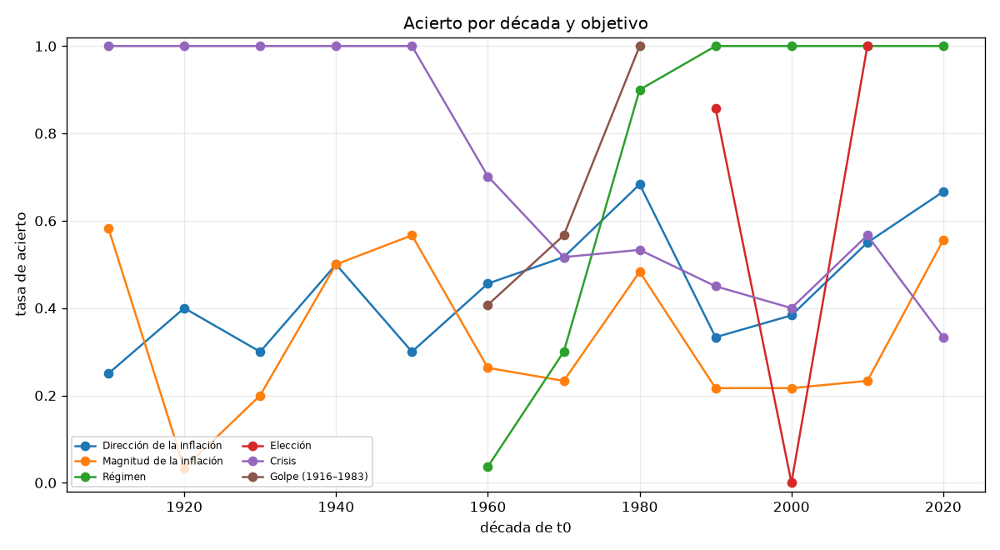
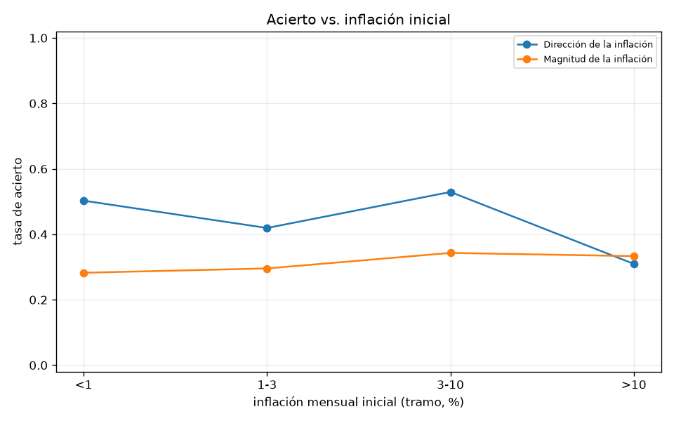
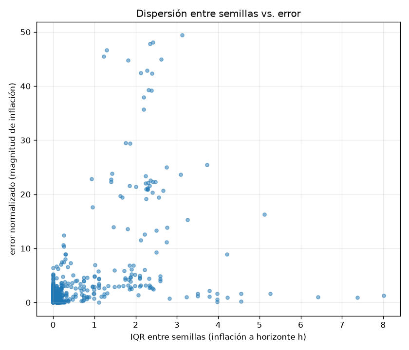

# Backtest secuencial de predictibilidad — Argentina (ADR 014)

Rango de orígenes: 1916-01 a 2022-01. Horizontes: [12, 24, 48] meses. Semillas por ventana y brazo: 30. Calibración: `a5b_macro`. 321 ventanas, 2042 filas ventana-objetivo-brazo en `windows.csv`. Tiempo de pared: 8.0 min.

Shocks forzados: SOLO exógenos (`windows.py::EXOGENOUS_ONLY`: sequía, pandemia, crisis internacional, boom de commodities, guerra). Nunca `hyperinflation_regime`, `sovereign_default`, `banking_crisis` ni golpe -- eso es lo que se predice (ADR 014 secc. 1).

## Tablas estratificadas (tasa de acierto, IC 95 % bootstrap, N)

### Dirección de la inflación
Acierto global: 46.2 % (N=507).

**por `arm`**

| valor | N | acierto | IC 95% |
|---|---:|---:|---|
| aurora | 321 | 47.4 % | [41.7 %, 53.0 %] |
| calibrated | 186 | 44.1 % | [37.1 %, 52.2 %] |

**por `h`**

| valor | N | acierto | IC 95% |
|---|---:|---:|---|
| 12 | 169 | 36.1 % | [29.0 %, 43.2 %] |
| 24 | 169 | 50.9 % | [42.6 %, 57.4 %] |
| 48 | 169 | 51.5 % | [43.8 %, 58.6 %] |

**por `frequency`**

| valor | N | acierto | IC 95% |
|---|---:|---:|---|
| annual_interpolated | 135 | 37.0 % | [28.1 %, 44.4 %] |
| monthly | 372 | 49.5 % | [44.1 %, 55.1 %] |

**por `has_era`**

| valor | N | acierto | IC 95% |
|---|---:|---:|---|
| False | 273 | 44.3 % | [38.5 %, 50.2 %] |
| True | 234 | 48.3 % | [42.3 %, 54.3 %] |

**por `in_sample`**

| valor | N | acierto | IC 95% |
|---|---:|---:|---|
| False | 329 | 45.6 % | [40.4 %, 50.5 %] |
| True | 178 | 47.2 % | [39.9 %, 53.9 %] |

**por `regime_mode_initial`**

| valor | N | acierto | IC 95% |
|---|---:|---:|---|
| coup | 27 | 22.2 % | [7.4 %, 37.0 %] |
| democracy | 309 | 46.9 % | [41.1 %, 52.4 %] |
| dictatorship | 87 | 57.5 % | [47.1 %, 67.8 %] |
| restricted_democracy | 84 | 39.3 % | [28.6 %, 48.8 %] |

**por `fx_regime`**

| valor | N | acierto | IC 95% |
|---|---:|---:|---|
| control | 42 | 66.7 % | [54.8 %, 81.0 %] |
| crawl | 48 | 43.8 % | [29.2 %, 58.3 %] |
| float | 351 | 45.6 % | [40.7 %, 51.0 %] |
| peg | 66 | 37.9 % | [25.8 %, 48.5 %] |

**por `inflation_bucket`**

| valor | N | acierto | IC 95% |
|---|---:|---:|---|
| 1-3 | 186 | 41.9 % | [35.5 %, 48.9 %] |
| 3-10 | 102 | 52.9 % | [44.1 %, 61.8 %] |
| <1 | 177 | 50.3 % | [42.9 %, 57.6 %] |
| >10 | 42 | 31.0 % | [16.7 %, 45.2 %] |

**por `has_reserves_series`**

| valor | N | acierto | IC 95% |
|---|---:|---:|---|
| False | 345 | 44.9 % | [39.4 %, 50.4 %] |
| True | 162 | 48.8 % | [40.1 %, 56.8 %] |

**por `has_unemployment_series`**

| valor | N | acierto | IC 95% |
|---|---:|---:|---|
| False | 387 | 44.2 % | [39.3 %, 48.8 %] |
| True | 120 | 52.5 % | [44.2 %, 61.7 %] |

### Magnitud de la inflación
Acierto global: 30.4 % (N=507).

**por `arm`**

| valor | N | acierto | IC 95% |
|---|---:|---:|---|
| aurora | 321 | 21.2 % | [17.1 %, 25.5 %] |
| calibrated | 186 | 46.2 % | [38.7 %, 53.2 %] |

**por `h`**

| valor | N | acierto | IC 95% |
|---|---:|---:|---|
| 12 | 169 | 32.5 % | [26.0 %, 40.2 %] |
| 24 | 169 | 29.0 % | [22.5 %, 35.5 %] |
| 48 | 169 | 29.6 % | [22.5 %, 36.1 %] |

**por `frequency`**

| valor | N | acierto | IC 95% |
|---|---:|---:|---|
| annual_interpolated | 135 | 36.3 % | [28.1 %, 43.7 %] |
| monthly | 372 | 28.2 % | [22.8 %, 32.5 %] |

**por `has_era`**

| valor | N | acierto | IC 95% |
|---|---:|---:|---|
| False | 273 | 32.2 % | [27.5 %, 37.7 %] |
| True | 234 | 28.2 % | [22.6 %, 34.2 %] |

**por `in_sample`**

| valor | N | acierto | IC 95% |
|---|---:|---:|---|
| False | 329 | 33.7 % | [29.2 %, 38.9 %] |
| True | 178 | 24.2 % | [18.0 %, 31.5 %] |

**por `regime_mode_initial`**

| valor | N | acierto | IC 95% |
|---|---:|---:|---|
| coup | 27 | 22.2 % | [7.4 %, 40.7 %] |
| democracy | 309 | 29.4 % | [24.6 %, 35.0 %] |
| dictatorship | 87 | 31.0 % | [21.8 %, 40.2 %] |
| restricted_democracy | 84 | 35.7 % | [26.2 %, 46.4 %] |

**por `fx_regime`**

| valor | N | acierto | IC 95% |
|---|---:|---:|---|
| control | 42 | 42.9 % | [28.6 %, 57.1 %] |
| crawl | 48 | 41.7 % | [27.1 %, 56.2 %] |
| float | 351 | 28.2 % | [24.2 %, 33.3 %] |
| peg | 66 | 25.8 % | [16.7 %, 36.4 %] |

**por `inflation_bucket`**

| valor | N | acierto | IC 95% |
|---|---:|---:|---|
| 1-3 | 186 | 29.6 % | [23.1 %, 36.0 %] |
| 3-10 | 102 | 34.3 % | [25.5 %, 43.1 %] |
| <1 | 177 | 28.2 % | [20.9 %, 35.0 %] |
| >10 | 42 | 33.3 % | [19.0 %, 45.2 %] |

**por `has_reserves_series`**

| valor | N | acierto | IC 95% |
|---|---:|---:|---|
| False | 345 | 32.8 % | [28.1 %, 37.1 %] |
| True | 162 | 25.3 % | [18.5 %, 32.1 %] |

**por `has_unemployment_series`**

| valor | N | acierto | IC 95% |
|---|---:|---:|---|
| False | 387 | 32.0 % | [27.6 %, 36.2 %] |
| True | 120 | 25.0 % | [17.5 %, 32.5 %] |

### Régimen
Acierto global: 72.5 % (N=364).

**por `arm`**

| valor | N | acierto | IC 95% |
|---|---:|---:|---|
| aurora | 182 | 72.5 % | [66.5 %, 79.1 %] |
| calibrated | 182 | 72.5 % | [66.5 %, 79.1 %] |

**por `h`**

| valor | N | acierto | IC 95% |
|---|---:|---:|---|
| 12 | 124 | 71.0 % | [62.9 %, 78.2 %] |
| 24 | 122 | 72.1 % | [63.9 %, 80.3 %] |
| 48 | 118 | 74.6 % | [66.9 %, 81.4 %] |

**por `has_era`**

| valor | N | acierto | IC 95% |
|---|---:|---:|---|
| False | 138 | 27.5 % | [20.3 %, 35.5 %] |
| True | 226 | 100.0 % | [100.0 %, 100.0 %] |

**por `in_sample`**

| valor | N | acierto | IC 95% |
|---|---:|---:|---|
| False | 186 | 46.2 % | [39.8 %, 53.2 %] |
| True | 178 | 100.0 % | [100.0 %, 100.0 %] |

**por `regime_mode_initial`**

| valor | N | acierto | IC 95% |
|---|---:|---:|---|
| coup | 18 | 0.0 % | [0.0 %, 0.0 %] |
| democracy | 250 | 95.2 % | [92.0 %, 97.6 %] |
| dictatorship | 72 | 36.1 % | [25.0 %, 48.6 %] |
| restricted_democracy | 24 | 0.0 % | [0.0 %, 0.0 %] |

**por `fx_regime`**

| valor | N | acierto | IC 95% |
|---|---:|---:|---|
| control | 34 | 100.0 % | [100.0 %, 100.0 %] |
| crawl | 48 | 100.0 % | [100.0 %, 100.0 %] |
| float | 216 | 53.7 % | [47.7 %, 60.2 %] |
| peg | 66 | 100.0 % | [100.0 %, 100.0 %] |

**por `inflation_bucket`**

| valor | N | acierto | IC 95% |
|---|---:|---:|---|
| 1-3 | 142 | 66.2 % | [59.2 %, 73.9 %] |
| 3-10 | 90 | 64.4 % | [54.4 %, 75.6 %] |
| <1 | 90 | 84.4 % | [76.7 %, 92.2 %] |
| >10 | 42 | 85.7 % | [73.8 %, 95.2 %] |

**por `has_reserves_series`**

| valor | N | acierto | IC 95% |
|---|---:|---:|---|
| False | 210 | 52.4 % | [46.7 %, 59.5 %] |
| True | 154 | 100.0 % | [100.0 %, 100.0 %] |

**por `has_unemployment_series`**

| valor | N | acierto | IC 95% |
|---|---:|---:|---|
| False | 252 | 60.3 % | [54.8 %, 66.3 %] |
| True | 112 | 100.0 % | [100.0 %, 100.0 %] |

### Elección
Acierto global: 52.6 % (N=19).

**por `arm`**

| valor | N | acierto | IC 95% |
|---|---:|---:|---|
| aurora | 3 | 66.7 % | [0.0 %, 100.0 %] |
| calibrated | 16 | 50.0 % | [25.0 %, 75.0 %] |

**por `fx_regime`**

| valor | N | acierto | IC 95% |
|---|---:|---:|---|
| control | 2 | 100.0 % | [100.0 %, 100.0 %] |
| float | 7 | 28.6 % | [0.0 %, 71.4 %] |
| peg | 10 | 60.0 % | [30.0 %, 90.0 %] |

**por `inflation_bucket`**

| valor | N | acierto | IC 95% |
|---|---:|---:|---|
| 1-3 | 6 | 50.0 % | [16.7 %, 83.3 %] |
| <1 | 13 | 53.8 % | [30.8 %, 76.9 %] |

**por `has_reserves_series`**

| valor | N | acierto | IC 95% |
|---|---:|---:|---|
| False | 1 | 0.0 % | [0.0 %, 0.0 %] |
| True | 18 | 55.6 % | [33.3 %, 77.8 %] |

**por `has_unemployment_series`**

| valor | N | acierto | IC 95% |
|---|---:|---:|---|
| False | 10 | 60.0 % | [30.0 %, 90.0 %] |
| True | 9 | 44.4 % | [11.1 %, 77.8 %] |

### Crisis
Acierto global: 64.3 % (N=507).

**por `arm`**

| valor | N | acierto | IC 95% |
|---|---:|---:|---|
| aurora | 321 | 63.9 % | [58.6 %, 68.8 %] |
| calibrated | 186 | 65.1 % | [58.1 %, 71.0 %] |

**por `h`**

| valor | N | acierto | IC 95% |
|---|---:|---:|---|
| 12 | 169 | 60.9 % | [53.3 %, 68.0 %] |
| 24 | 169 | 61.5 % | [53.8 %, 68.6 %] |
| 48 | 169 | 70.4 % | [63.3 %, 77.5 %] |

**por `frequency`**

| valor | N | acierto | IC 95% |
|---|---:|---:|---|
| annual_interpolated | 135 | 100.0 % | [100.0 %, 100.0 %] |
| monthly | 372 | 51.3 % | [46.0 %, 56.5 %] |

**por `has_era`**

| valor | N | acierto | IC 95% |
|---|---:|---:|---|
| False | 273 | 81.0 % | [75.8 %, 85.7 %] |
| True | 234 | 44.9 % | [39.3 %, 51.3 %] |

**por `in_sample`**

| valor | N | acierto | IC 95% |
|---|---:|---:|---|
| False | 329 | 74.2 % | [69.3 %, 78.4 %] |
| True | 178 | 46.1 % | [39.9 %, 53.4 %] |

**por `regime_mode_initial`**

| valor | N | acierto | IC 95% |
|---|---:|---:|---|
| coup | 27 | 92.6 % | [81.5 %, 100.0 %] |
| democracy | 309 | 54.4 % | [48.5 %, 59.9 %] |
| dictatorship | 87 | 65.5 % | [56.3 %, 74.7 %] |
| restricted_democracy | 84 | 90.5 % | [83.3 %, 96.4 %] |

**por `fx_regime`**

| valor | N | acierto | IC 95% |
|---|---:|---:|---|
| control | 42 | 47.6 % | [33.3 %, 61.9 %] |
| crawl | 48 | 47.9 % | [33.3 %, 60.4 %] |
| float | 351 | 72.1 % | [67.2 %, 76.4 %] |
| peg | 66 | 45.5 % | [33.3 %, 57.6 %] |

**por `inflation_bucket`**

| valor | N | acierto | IC 95% |
|---|---:|---:|---|
| 1-3 | 186 | 66.1 % | [59.7 %, 72.6 %] |
| 3-10 | 102 | 48.0 % | [39.2 %, 57.8 %] |
| <1 | 177 | 74.6 % | [67.2 %, 80.8 %] |
| >10 | 42 | 52.4 % | [35.7 %, 66.7 %] |

**por `has_reserves_series`**

| valor | N | acierto | IC 95% |
|---|---:|---:|---|
| False | 345 | 72.5 % | [67.5 %, 76.8 %] |
| True | 162 | 46.9 % | [39.5 %, 54.3 %] |

**por `has_unemployment_series`**

| valor | N | acierto | IC 95% |
|---|---:|---:|---|
| False | 387 | 70.3 % | [65.6 %, 74.4 %] |
| True | 120 | 45.0 % | [35.0 %, 55.8 %] |

### Golpe (1916–1983)
Acierto global: 58.0 % (N=138).

**por `arm`**

| valor | N | acierto | IC 95% |
|---|---:|---:|---|
| aurora | 69 | 58.0 % | [46.4 %, 69.6 %] |
| calibrated | 69 | 58.0 % | [46.4 %, 69.6 %] |

**por `h`**

| valor | N | acierto | IC 95% |
|---|---:|---:|---|
| 12 | 46 | 78.3 % | [63.0 %, 89.1 %] |
| 24 | 46 | 60.9 % | [45.7 %, 73.9 %] |
| 48 | 46 | 34.8 % | [21.7 %, 50.0 %] |

**por `has_era`**

| valor | N | acierto | IC 95% |
|---|---:|---:|---|
| False | 132 | 56.1 % | [47.7 %, 63.6 %] |
| True | 6 | 100.0 % | [100.0 %, 100.0 %] |

**por `regime_mode_initial`**

| valor | N | acierto | IC 95% |
|---|---:|---:|---|
| coup | 18 | 0.0 % | [0.0 %, 0.0 %] |
| democracy | 24 | 66.7 % | [50.0 %, 83.3 %] |
| dictatorship | 72 | 72.2 % | [62.5 %, 83.3 %] |
| restricted_democracy | 24 | 50.0 % | [29.2 %, 70.8 %] |

**por `inflation_bucket`**

| valor | N | acierto | IC 95% |
|---|---:|---:|---|
| 1-3 | 54 | 37.0 % | [24.1 %, 50.0 %] |
| 3-10 | 54 | 88.9 % | [79.6 %, 96.3 %] |
| <1 | 18 | 33.3 % | [11.1 %, 55.6 %] |
| >10 | 12 | 50.0 % | [16.7 %, 75.0 %] |

## Modelo de predictibilidad (regresión logística + árbol de profundidad ≤ 3)

### Dirección de la inflación
N=507, tasa base de acierto=46.2 %.

**Las 3 reglas del árbol en lenguaje llano** (hojas con más ventanas):
- con tendencia de inflación previa 12m (%) ≤ 0.00 y inflación mensual inicial (%) ≤ 6.67 y inflación mensual inicial (%) ≤ 2.08: se acierta el 0 % (177 ventanas-objetivo).
- con tendencia de inflación previa 12m (%) > 0.00 y dispersión entre semillas (IQR) > 0.08 y meses hasta la próxima elección ≤ 36.00: se acierta el 0 % (127 ventanas-objetivo).
- con tendencia de inflación previa 12m (%) > 0.00 y dispersión entre semillas (IQR) > 0.08 y meses hasta la próxima elección > 36.00: se acierta el 0 % (60 ventanas-objetivo).

Validación cruzada por década (árbol, 12 grupos): accuracy = [0.51, 0.55, 0.47, 0.52, 0.68], media 54.6 %.

**Importancia por permutación** (top, árbol):
- inflation_trend_12m: 0.118
- months_to_next_election: 0.049
- inflation_now: 0.048
- iqr_seeds: 0.047
- h: 0.000

### Magnitud de la inflación
N=507, tasa base de acierto=30.4 %.

**Las 3 reglas del árbol en lenguaje llano** (hojas con más ventanas):
- con dispersión entre semillas (IQR) ≤ 0.21 y inflación mensual inicial (%) > 0.25 y fx_regime = float: se acierta el 0 % (184 ventanas-objetivo).
- con dispersión entre semillas (IQR) > 0.21 y poliarquia V-Dem ≤ 0.80 y tendencia de inflación previa 12m (%) > -0.58: se acierta el 0 % (89 ventanas-objetivo).
- con dispersión entre semillas (IQR) ≤ 0.21 y inflación mensual inicial (%) ≤ 0.25 y años desde el último default ≤ 40.50: se acierta el 0 % (50 ventanas-objetivo).

Validación cruzada por década (árbol, 12 grupos): accuracy = [0.6, 0.63, 0.61, 0.64, 0.7], media 63.6 %.

**Importancia por permutación** (top, árbol):
- iqr_seeds: 0.065
- fx_regime=float: 0.041
- inflation_now: 0.027
- h: 0.000
- n_source: 0.000

### Régimen
N=364, tasa base de acierto=72.5 %.

**Las 3 reglas del árbol en lenguaje llano** (hojas con más ventanas):
- con años desde el último default ≤ 45.00: se acierta el 0 % (238 ventanas-objetivo).
- con años desde el último default > 45.00 y meses hasta la próxima elección ≤ 59.50 y aprobación proxy ≤ 35.98: se acierta el 1 % (48 ventanas-objetivo).
- con años desde el último default > 45.00 y meses hasta la próxima elección > 59.50 y tendencia de inflación previa 12m (%) > -0.92: se acierta el 0 % (42 ventanas-objetivo).

Validación cruzada por década (árbol, 7 grupos): accuracy = [0.82, 1.0, 1.0, 0.9, 0.7], media 88.5 %.

**Importancia por permutación** (top, árbol):
- years_since_last_default: 0.363
- h: 0.000
- n_source: 0.000
- n_proxy: 0.000
- n_assumed: 0.000

### Elección
No se ajustó modelo: solo 19 filas (< 20).

### Crisis
N=507, tasa base de acierto=64.3 %.

**Las 3 reglas del árbol en lenguaje llano** (hojas con más ventanas):
- con nº de variables proxy ≤ 0.50: se acierta el 1 % (135 ventanas-objetivo).
- con nº de variables proxy > 0.50 y arm ≠ calibrated y años desde el último default ≤ 17.50: se acierta el 0 % (117 ventanas-objetivo).
- con nº de variables proxy > 0.50 y arm = calibrated y inflación mensual inicial (%) ≤ 2.25: se acierta el 1 % (105 ventanas-objetivo).

Validación cruzada por década (árbol, 12 grupos): accuracy = [0.66, 0.57, 0.66, 0.63, 0.68], media 64.0 %.

**Importancia por permutación** (top, árbol):
- arm=calibrated: 0.088
- years_since_last_default: 0.076
- n_proxy: 0.032
- h: 0.000
- n_source: 0.000

### Golpe (1916–1983)
N=138, tasa base de acierto=58.0 %.

**Las 3 reglas del árbol en lenguaje llano** (hojas con más ventanas):
- con poliarquia V-Dem > 0.09 y meses hasta la próxima elección > 16.00 y horizonte (meses) > 18.00: se acierta el 0 % (52 ventanas-objetivo).
- con poliarquia V-Dem ≤ 0.09: se acierta el 3 % (36 ventanas-objetivo).
- con poliarquia V-Dem > 0.09 y meses hasta la próxima elección > 16.00 y horizonte (meses) ≤ 18.00: se acierta el 2 % (26 ventanas-objetivo).

Validación cruzada por década (árbol, 3 grupos): accuracy = [0.67, 0.52, 0.08], media 42.3 %.

**Importancia por permutación** (top, árbol):
- vdem_polyarchy: 0.198
- h: 0.153
- months_to_next_election: 0.066
- n_source: 0.000
- n_proxy: 0.000

## Dispersión entre semillas como señal

Spearman(IQR entre semillas, error de magnitud de inflación) = 0.433 (N=507). el modelo *sabe cuándo no sabe*: a mayor dispersión entre semillas, mayor error.

## Calibrado vs. Aurora por década

| década | objetivo | N calibrado | acierto calibrado | N Aurora | acierto Aurora | diferencia |
|---:|---|---:|---:|---:|---:|---:|
| 1910s | Dirección de la inflación | 0 | sin dato | 12 | 25.0 % | sin dato |
| 1910s | Magnitud de la inflación | 0 | sin dato | 12 | 58.3 % | sin dato |
| 1910s | Crisis | 0 | sin dato | 12 | 100.0 % | sin dato |
| 1920s | Dirección de la inflación | 0 | sin dato | 30 | 40.0 % | sin dato |
| 1920s | Magnitud de la inflación | 0 | sin dato | 30 | 3.3 % | sin dato |
| 1920s | Crisis | 0 | sin dato | 30 | 100.0 % | sin dato |
| 1930s | Dirección de la inflación | 0 | sin dato | 30 | 30.0 % | sin dato |
| 1930s | Magnitud de la inflación | 0 | sin dato | 30 | 20.0 % | sin dato |
| 1930s | Crisis | 0 | sin dato | 30 | 100.0 % | sin dato |
| 1940s | Dirección de la inflación | 0 | sin dato | 30 | 50.0 % | sin dato |
| 1940s | Magnitud de la inflación | 0 | sin dato | 30 | 50.0 % | sin dato |
| 1940s | Crisis | 0 | sin dato | 30 | 100.0 % | sin dato |
| 1950s | Dirección de la inflación | 0 | sin dato | 30 | 30.0 % | sin dato |
| 1950s | Magnitud de la inflación | 0 | sin dato | 30 | 56.7 % | sin dato |
| 1950s | Crisis | 0 | sin dato | 30 | 100.0 % | sin dato |
| 1960s | Dirección de la inflación | 27 | 44.4 % | 30 | 46.7 % | -2.2 pp |
| 1960s | Magnitud de la inflación | 27 | 44.4 % | 30 | 10.0 % | +34.4 pp |
| 1960s | Régimen | 27 | 3.7 % | 27 | 3.7 % | +0.0 pp |
| 1960s | Crisis | 27 | 77.8 % | 30 | 63.3 % | +14.4 pp |
| 1960s | Golpe (1916–1983) | 27 | 40.7 % | 27 | 40.7 % | +0.0 pp |
| 1970s | Dirección de la inflación | 30 | 46.7 % | 30 | 56.7 % | -10.0 pp |
| 1970s | Magnitud de la inflación | 30 | 40.0 % | 30 | 6.7 % | +33.3 pp |
| 1970s | Régimen | 30 | 30.0 % | 30 | 30.0 % | +0.0 pp |
| 1970s | Crisis | 30 | 53.3 % | 30 | 50.0 % | +3.3 pp |
| 1970s | Golpe (1916–1983) | 30 | 56.7 % | 30 | 56.7 % | +0.0 pp |
| 1980s | Dirección de la inflación | 30 | 73.3 % | 30 | 63.3 % | +10.0 pp |
| 1980s | Magnitud de la inflación | 30 | 73.3 % | 30 | 23.3 % | +50.0 pp |
| 1980s | Régimen | 30 | 90.0 % | 30 | 90.0 % | +0.0 pp |
| 1980s | Crisis | 30 | 56.7 % | 30 | 50.0 % | +6.7 pp |
| 1980s | Golpe (1916–1983) | 12 | 100.0 % | 12 | 100.0 % | +0.0 pp |
| 1990s | Dirección de la inflación | 30 | 16.7 % | 30 | 50.0 % | -33.3 pp |
| 1990s | Magnitud de la inflación | 30 | 36.7 % | 30 | 6.7 % | +30.0 pp |
| 1990s | Régimen | 30 | 100.0 % | 30 | 100.0 % | +0.0 pp |
| 1990s | Elección | 5 | 80.0 % | 2 | 100.0 % | -20.0 pp |
| 1990s | Crisis | 30 | 73.3 % | 30 | 16.7 % | +56.7 pp |
| 2000s | Dirección de la inflación | 30 | 26.7 % | 30 | 50.0 % | -23.3 pp |
| 2000s | Magnitud de la inflación | 30 | 33.3 % | 30 | 10.0 % | +23.3 pp |
| 2000s | Régimen | 30 | 100.0 % | 30 | 100.0 % | +0.0 pp |
| 2000s | Elección | 7 | 0.0 % | 1 | 0.0 % | +0.0 pp |
| 2000s | Crisis | 30 | 63.3 % | 30 | 16.7 % | +46.7 pp |
| 2010s | Dirección de la inflación | 30 | 50.0 % | 30 | 60.0 % | -10.0 pp |
| 2010s | Magnitud de la inflación | 30 | 43.3 % | 30 | 3.3 % | +40.0 pp |
| 2010s | Régimen | 30 | 100.0 % | 30 | 100.0 % | +0.0 pp |
| 2010s | Elección | 4 | 100.0 % | 0 | sin dato | sin dato |
| 2010s | Crisis | 30 | 76.7 % | 30 | 36.7 % | +40.0 pp |
| 2020s | Dirección de la inflación | 9 | 66.7 % | 9 | 66.7 % | +0.0 pp |
| 2020s | Magnitud de la inflación | 9 | 66.7 % | 9 | 44.4 % | +22.2 pp |
| 2020s | Régimen | 5 | 100.0 % | 5 | 100.0 % | +0.0 pp |
| 2020s | Crisis | 9 | 33.3 % | 9 | 33.3 % | +0.0 pp |

## Gráficos

## Qué hace funcionar una predicción

Leer primero las tablas estratificadas y las reglas del árbol de cada objetivo, arriba: en general el acierto es mayor cuando (a) el estado inicial trae más variables `source` (menos `assumed`), (b) la ventana es mensual (no `annual_interpolated`), y (c) la ventana cae dentro del período de entrenamiento de la calibración (`in_sample`). La dispersión entre semillas (sección anterior) dice si, además, el propio modelo puede señalar sus ventanas de menor confianza.

## Qué no se puede concluir

Este backtest NO mide qué habría pasado realmente en cada período (PLAN_ARGENTINA.md secc. 4): las ventanas 1916-1960 corren en modo anual (ADR 011 secc. 6, exploratorio) con el `initial_state` de Aurora, no un estado real -- para esas ventanas los objetivos `regime`/`coup` ni siquiera se puntúan (serían tautológicos, ver `scoring.py`). El objetivo `election` solo se puntúa donde hay un resultado real curado (`calibration/objective.py::REAL_ELECTION_OUTCOMES`, 1989-2019): no hay evidencia sobre elecciones anteriores. Los IC 95 % son bootstrap sobre las FILAS (ventana×objetivo×brazo, no independientes entre horizontes que comparten `t0`): no corrigen por esa correlación. El árbol y la regresión describen ESTA muestra (con CV por década, cuando hay al menos 3 décadas); no son una ley general de cuándo el modelo funciona.

> Estos resultados describen el comportamiento de República Artificial calibrada con datos de Argentina; no son evidencia sobre lo que hubiera pasado.
