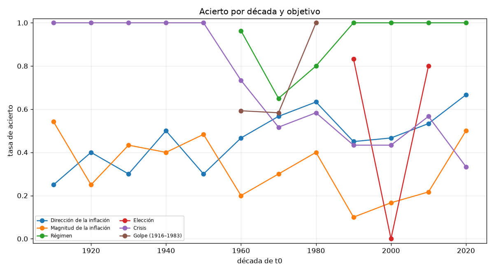
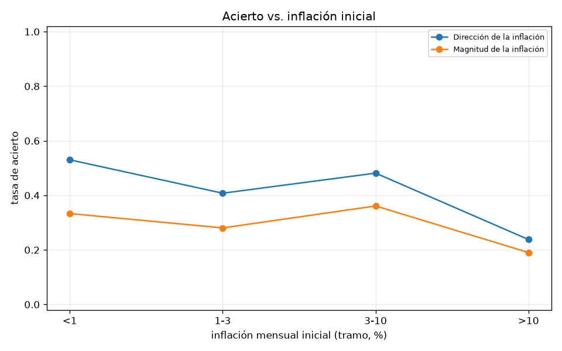
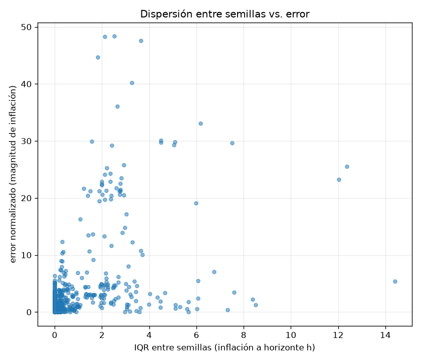

# Backtest secuencial de predictibilidad — Argentina (ADR 014)

Rango de orígenes: 1916-01 a 2022-01. Horizontes: [12, 24, 48] meses. Semillas por ventana y brazo: 30. Calibración: `a7_by_regime`. 321 ventanas, 2455 filas ventana-objetivo-brazo en `windows.csv`. Tiempo de pared: 4.4 min.

Shocks forzados: SOLO exógenos (`windows.py::EXOGENOUS_ONLY`: sequía, pandemia, crisis internacional, boom de commodities, guerra). Nunca `hyperinflation_regime`, `sovereign_default`, `banking_crisis` ni golpe -- eso es lo que se predice (ADR 014 secc. 1).

## Tablas estratificadas (tasa de acierto, IC 95 % bootstrap, N)

### Dirección de la inflación
Acierto global: 46.0 % (N=642).

**por `arm`**

| valor | N | acierto | IC 95% |
|---|---:|---:|---|
| aurora | 321 | 47.4 % | [42.1 %, 52.6 %] |
| calibrated | 321 | 44.5 % | [38.6 %, 49.8 %] |

**por `h`**

| valor | N | acierto | IC 95% |
|---|---:|---:|---|
| 12 | 214 | 28.5 % | [22.0 %, 35.0 %] |
| 24 | 214 | 50.9 % | [43.9 %, 57.5 %] |
| 48 | 214 | 58.4 % | [51.9 %, 65.4 %] |

**por `frequency`**

| valor | N | acierto | IC 95% |
|---|---:|---:|---|
| annual_interpolated | 270 | 37.0 % | [31.5 %, 43.0 %] |
| monthly | 372 | 52.4 % | [47.3 %, 58.1 %] |

**por `has_era`**

| valor | N | acierto | IC 95% |
|---|---:|---:|---|
| False | 408 | 43.4 % | [39.0 %, 48.3 %] |
| True | 234 | 50.4 % | [44.0 %, 56.4 %] |

**por `in_sample`**

| valor | N | acierto | IC 95% |
|---|---:|---:|---|
| False | 464 | 43.1 % | [39.0 %, 47.8 %] |
| True | 178 | 53.4 % | [44.9 %, 61.2 %] |

**por `regime_mode_initial`**

| valor | N | acierto | IC 95% |
|---|---:|---:|---|
| coup | 36 | 27.8 % | [13.9 %, 44.4 %] |
| democracy | 360 | 48.1 % | [43.1 %, 53.3 %] |
| dictatorship | 102 | 58.8 % | [49.0 %, 68.6 %] |
| restricted_democracy | 144 | 36.1 % | [27.8 %, 44.4 %] |

**por `fx_regime`**

| valor | N | acierto | IC 95% |
|---|---:|---:|---|
| control | 42 | 66.7 % | [54.8 %, 81.0 %] |
| crawl | 48 | 37.5 % | [22.9 %, 54.2 %] |
| float | 486 | 44.0 % | [39.9 %, 48.4 %] |
| peg | 66 | 53.0 % | [40.9 %, 66.7 %] |

**por `inflation_bucket`**

| valor | N | acierto | IC 95% |
|---|---:|---:|---|
| 1-3 | 228 | 40.8 % | [34.2 %, 47.4 %] |
| 3-10 | 108 | 48.1 % | [38.0 %, 57.4 %] |
| <1 | 264 | 53.0 % | [47.0 %, 59.1 %] |
| >10 | 42 | 23.8 % | [9.5 %, 35.7 %] |

**por `has_reserves_series`**

| valor | N | acierto | IC 95% |
|---|---:|---:|---|
| False | 480 | 42.7 % | [38.3 %, 47.1 %] |
| True | 162 | 55.6 % | [48.1 %, 64.2 %] |

**por `has_unemployment_series`**

| valor | N | acierto | IC 95% |
|---|---:|---:|---|
| False | 522 | 44.3 % | [40.0 %, 47.9 %] |
| True | 120 | 53.3 % | [44.2 %, 61.7 %] |

### Magnitud de la inflación
Acierto global: 31.0 % (N=642).

**por `arm`**

| valor | N | acierto | IC 95% |
|---|---:|---:|---|
| aurora | 321 | 21.5 % | [17.1 %, 25.9 %] |
| calibrated | 321 | 40.5 % | [34.9 %, 45.8 %] |

**por `h`**

| valor | N | acierto | IC 95% |
|---|---:|---:|---|
| 12 | 214 | 32.7 % | [27.1 %, 39.7 %] |
| 24 | 214 | 30.4 % | [23.8 %, 36.9 %] |
| 48 | 214 | 29.9 % | [24.8 %, 36.0 %] |

**por `frequency`**

| valor | N | acierto | IC 95% |
|---|---:|---:|---|
| annual_interpolated | 270 | 40.7 % | [35.2 %, 46.7 %] |
| monthly | 372 | 23.9 % | [19.1 %, 28.5 %] |

**por `has_era`**

| valor | N | acierto | IC 95% |
|---|---:|---:|---|
| False | 408 | 36.5 % | [31.9 %, 41.2 %] |
| True | 234 | 21.4 % | [16.2 %, 26.5 %] |

**por `in_sample`**

| valor | N | acierto | IC 95% |
|---|---:|---:|---|
| False | 464 | 35.6 % | [31.7 %, 40.1 %] |
| True | 178 | 19.1 % | [13.5 %, 25.3 %] |

**por `regime_mode_initial`**

| valor | N | acierto | IC 95% |
|---|---:|---:|---|
| coup | 36 | 25.0 % | [11.1 %, 41.7 %] |
| democracy | 360 | 26.7 % | [21.9 %, 31.7 %] |
| dictatorship | 102 | 30.4 % | [21.6 %, 39.2 %] |
| restricted_democracy | 144 | 43.8 % | [36.1 %, 51.4 %] |

**por `fx_regime`**

| valor | N | acierto | IC 95% |
|---|---:|---:|---|
| control | 42 | 40.5 % | [26.2 %, 54.8 %] |
| crawl | 48 | 27.1 % | [14.6 %, 41.7 %] |
| float | 486 | 32.3 % | [28.4 %, 36.8 %] |
| peg | 66 | 18.2 % | [9.1 %, 28.8 %] |

**por `inflation_bucket`**

| valor | N | acierto | IC 95% |
|---|---:|---:|---|
| 1-3 | 228 | 28.1 % | [22.4 %, 33.8 %] |
| 3-10 | 108 | 36.1 % | [26.9 %, 44.4 %] |
| <1 | 264 | 33.3 % | [27.7 %, 39.0 %] |
| >10 | 42 | 19.0 % | [7.1 %, 31.0 %] |

**por `has_reserves_series`**

| valor | N | acierto | IC 95% |
|---|---:|---:|---|
| False | 480 | 34.2 % | [30.2 %, 38.5 %] |
| True | 162 | 21.6 % | [14.8 %, 27.8 %] |

**por `has_unemployment_series`**

| valor | N | acierto | IC 95% |
|---|---:|---:|---|
| False | 522 | 33.1 % | [28.7 %, 36.8 %] |
| True | 120 | 21.7 % | [15.0 %, 28.3 %] |

### Régimen
Acierto global: 90.4 % (N=364).

**por `arm`**

| valor | N | acierto | IC 95% |
|---|---:|---:|---|
| aurora | 182 | 90.7 % | [86.3 %, 95.1 %] |
| calibrated | 182 | 90.1 % | [85.7 %, 94.5 %] |

**por `h`**

| valor | N | acierto | IC 95% |
|---|---:|---:|---|
| 12 | 124 | 95.2 % | [91.1 %, 98.4 %] |
| 24 | 122 | 91.8 % | [86.1 %, 95.9 %] |
| 48 | 118 | 83.9 % | [76.3 %, 90.7 %] |

**por `has_era`**

| valor | N | acierto | IC 95% |
|---|---:|---:|---|
| False | 138 | 74.6 % | [67.4 %, 81.9 %] |
| True | 226 | 100.0 % | [100.0 %, 100.0 %] |

**por `in_sample`**

| valor | N | acierto | IC 95% |
|---|---:|---:|---|
| False | 186 | 81.2 % | [75.3 %, 86.6 %] |
| True | 178 | 100.0 % | [100.0 %, 100.0 %] |

**por `regime_mode_initial`**

| valor | N | acierto | IC 95% |
|---|---:|---:|---|
| coup | 18 | 100.0 % | [100.0 %, 100.0 %] |
| democracy | 250 | 95.2 % | [92.0 %, 97.6 %] |
| dictatorship | 72 | 68.1 % | [56.9 %, 79.2 %] |
| restricted_democracy | 24 | 100.0 % | [100.0 %, 100.0 %] |

**por `fx_regime`**

| valor | N | acierto | IC 95% |
|---|---:|---:|---|
| control | 34 | 100.0 % | [100.0 %, 100.0 %] |
| crawl | 48 | 100.0 % | [100.0 %, 100.0 %] |
| float | 216 | 83.8 % | [78.2 %, 88.9 %] |
| peg | 66 | 100.0 % | [100.0 %, 100.0 %] |

**por `inflation_bucket`**

| valor | N | acierto | IC 95% |
|---|---:|---:|---|
| 1-3 | 142 | 96.5 % | [93.0 %, 99.3 %] |
| 3-10 | 90 | 71.1 % | [62.2 %, 80.0 %] |
| <1 | 90 | 95.6 % | [91.1 %, 98.9 %] |
| >10 | 42 | 100.0 % | [100.0 %, 100.0 %] |

**por `has_reserves_series`**

| valor | N | acierto | IC 95% |
|---|---:|---:|---|
| False | 210 | 83.3 % | [77.6 %, 88.6 %] |
| True | 154 | 100.0 % | [100.0 %, 100.0 %] |

**por `has_unemployment_series`**

| valor | N | acierto | IC 95% |
|---|---:|---:|---|
| False | 252 | 86.1 % | [81.3 %, 90.5 %] |
| True | 112 | 100.0 % | [100.0 %, 100.0 %] |

### Elección
Acierto global: 48.1 % (N=27).

**por `arm`**

| valor | N | acierto | IC 95% |
|---|---:|---:|---|
| aurora | 2 | 50.0 % | [0.0 %, 100.0 %] |
| calibrated | 25 | 48.0 % | [28.0 %, 68.0 %] |

**por `has_era`**

| valor | N | acierto | IC 95% |
|---|---:|---:|---|
| False | 1 | 0.0 % | [0.0 %, 0.0 %] |
| True | 26 | 50.0 % | [30.8 %, 69.2 %] |

**por `fx_regime`**

| valor | N | acierto | IC 95% |
|---|---:|---:|---|
| control | 4 | 100.0 % | [100.0 %, 100.0 %] |
| float | 13 | 30.8 % | [7.7 %, 53.8 %] |
| peg | 10 | 50.0 % | [20.0 %, 80.0 %] |

**por `inflation_bucket`**

| valor | N | acierto | IC 95% |
|---|---:|---:|---|
| 1-3 | 13 | 38.5 % | [7.7 %, 69.2 %] |
| 3-10 | 2 | 100.0 % | [100.0 %, 100.0 %] |
| <1 | 12 | 50.0 % | [25.0 %, 83.3 %] |

**por `has_reserves_series`**

| valor | N | acierto | IC 95% |
|---|---:|---:|---|
| False | 1 | 0.0 % | [0.0 %, 0.0 %] |
| True | 26 | 50.0 % | [30.8 %, 69.2 %] |

**por `has_unemployment_series`**

| valor | N | acierto | IC 95% |
|---|---:|---:|---|
| False | 10 | 50.0 % | [20.0 %, 80.0 %] |
| True | 17 | 47.1 % | [23.5 %, 70.6 %] |

### Crisis
Acierto global: 72.6 % (N=642).

**por `arm`**

| valor | N | acierto | IC 95% |
|---|---:|---:|---|
| aurora | 321 | 63.9 % | [58.9 %, 69.5 %] |
| calibrated | 321 | 81.3 % | [76.9 %, 85.4 %] |

**por `h`**

| valor | N | acierto | IC 95% |
|---|---:|---:|---|
| 12 | 214 | 70.1 % | [64.5 %, 76.2 %] |
| 24 | 214 | 70.1 % | [63.1 %, 76.2 %] |
| 48 | 214 | 77.6 % | [72.0 %, 82.7 %] |

**por `frequency`**

| valor | N | acierto | IC 95% |
|---|---:|---:|---|
| annual_interpolated | 270 | 100.0 % | [100.0 %, 100.0 %] |
| monthly | 372 | 52.7 % | [47.3 %, 57.5 %] |

**por `has_era`**

| valor | N | acierto | IC 95% |
|---|---:|---:|---|
| False | 408 | 87.3 % | [83.6 %, 90.7 %] |
| True | 234 | 47.0 % | [41.0 %, 53.8 %] |

**por `in_sample`**

| valor | N | acierto | IC 95% |
|---|---:|---:|---|
| False | 464 | 82.3 % | [78.4 %, 85.8 %] |
| True | 178 | 47.2 % | [41.0 %, 55.1 %] |

**por `regime_mode_initial`**

| valor | N | acierto | IC 95% |
|---|---:|---:|---|
| coup | 36 | 94.4 % | [86.1 %, 100.0 %] |
| democracy | 360 | 61.9 % | [56.7 %, 67.5 %] |
| dictatorship | 102 | 70.6 % | [60.8 %, 79.4 %] |
| restricted_democracy | 144 | 95.1 % | [91.7 %, 97.9 %] |

**por `fx_regime`**

| valor | N | acierto | IC 95% |
|---|---:|---:|---|
| control | 42 | 47.6 % | [33.3 %, 61.9 %] |
| crawl | 48 | 50.0 % | [35.4 %, 62.5 %] |
| float | 486 | 80.7 % | [77.4 %, 84.4 %] |
| peg | 66 | 45.5 % | [34.8 %, 56.1 %] |

**por `inflation_bucket`**

| valor | N | acierto | IC 95% |
|---|---:|---:|---|
| 1-3 | 228 | 71.9 % | [66.2 %, 77.6 %] |
| 3-10 | 108 | 50.9 % | [41.7 %, 60.2 %] |
| <1 | 264 | 84.5 % | [80.7 %, 88.6 %] |
| >10 | 42 | 57.1 % | [40.5 %, 73.8 %] |

**por `has_reserves_series`**

| valor | N | acierto | IC 95% |
|---|---:|---:|---|
| False | 480 | 81.0 % | [77.7 %, 84.6 %] |
| True | 162 | 47.5 % | [40.1 %, 54.9 %] |

**por `has_unemployment_series`**

| valor | N | acierto | IC 95% |
|---|---:|---:|---|
| False | 522 | 78.5 % | [74.7 %, 82.0 %] |
| True | 120 | 46.7 % | [37.5 %, 56.7 %] |

### Golpe (1916–1983)
Acierto global: 65.9 % (N=138).

**por `arm`**

| valor | N | acierto | IC 95% |
|---|---:|---:|---|
| aurora | 69 | 65.2 % | [53.6 %, 76.8 %] |
| calibrated | 69 | 66.7 % | [55.1 %, 78.3 %] |

**por `h`**

| valor | N | acierto | IC 95% |
|---|---:|---:|---|
| 12 | 46 | 78.3 % | [63.0 %, 89.1 %] |
| 24 | 46 | 65.2 % | [50.0 %, 78.3 %] |
| 48 | 46 | 54.3 % | [39.1 %, 67.4 %] |

**por `has_era`**

| valor | N | acierto | IC 95% |
|---|---:|---:|---|
| False | 132 | 64.4 % | [56.8 %, 73.5 %] |
| True | 6 | 100.0 % | [100.0 %, 100.0 %] |

**por `regime_mode_initial`**

| valor | N | acierto | IC 95% |
|---|---:|---:|---|
| coup | 18 | 0.0 % | [0.0 %, 0.0 %] |
| democracy | 24 | 70.8 % | [54.2 %, 87.5 %] |
| dictatorship | 72 | 72.2 % | [62.5 %, 81.9 %] |
| restricted_democracy | 24 | 91.7 % | [79.2 %, 100.0 %] |

**por `inflation_bucket`**

| valor | N | acierto | IC 95% |
|---|---:|---:|---|
| 1-3 | 54 | 55.6 % | [42.6 %, 70.4 %] |
| 3-10 | 54 | 90.7 % | [81.5 %, 98.1 %] |
| <1 | 18 | 33.3 % | [11.1 %, 55.6 %] |
| >10 | 12 | 50.0 % | [16.7 %, 75.0 %] |

## Modelo de predictibilidad (regresión logística + árbol de profundidad ≤ 3)

### Dirección de la inflación
N=642, tasa base de acierto=46.0 %.

**Las 3 reglas del árbol en lenguaje llano** (hojas con más ventanas):
- con tendencia de inflación previa 12m (%) > 0.00 y nº de variables asumidas (sin dato) ≤ 17.50 y meses hasta la próxima elección ≤ 36.00: se acierta el 0 % (132 ventanas-objetivo).
- con tendencia de inflación previa 12m (%) ≤ 0.00 y horizonte (meses) > 18.00 y inflación mensual inicial (%) ≤ 1.21: se acierta el 1 % (124 ventanas-objetivo).
- con tendencia de inflación previa 12m (%) > 0.00 y nº de variables asumidas (sin dato) > 17.50 y horizonte (meses) > 18.00: se acierta el 0 % (104 ventanas-objetivo).

Validación cruzada por década (árbol, 12 grupos): accuracy = [0.68, 0.57, 0.61, 0.69, 0.74], media 65.7 %.

**Importancia por permutación** (top, árbol):
- inflation_trend_12m: 0.132
- h: 0.074
- n_assumed: 0.061
- months_to_next_election: 0.043
- iqr_seeds: 0.041

### Magnitud de la inflación
N=642, tasa base de acierto=31.0 %.

**Las 3 reglas del árbol en lenguaje llano** (hojas con más ventanas):
- con dispersión entre semillas (IQR) ≤ 0.92 y dispersión entre semillas (IQR) ≤ 0.18 y inflación mensual inicial (%) ≤ 2.20: se acierta el 0 % (286 ventanas-objetivo).
- con dispersión entre semillas (IQR) ≤ 0.92 y dispersión entre semillas (IQR) > 0.18 y arm = calibrated: se acierta el 0 % (78 ventanas-objetivo).
- con dispersión entre semillas (IQR) ≤ 0.92 y dispersión entre semillas (IQR) ≤ 0.18 y inflación mensual inicial (%) > 2.20: se acierta el 1 % (61 ventanas-objetivo).

Validación cruzada por década (árbol, 12 grupos): accuracy = [0.65, 0.65, 0.48, 0.58, 0.62], media 59.8 %.

**Importancia por permutación** (top, árbol):
- iqr_seeds: 0.062
- inflation_now: 0.045
- h: 0.000
- n_source: 0.000
- n_proxy: 0.000

### Régimen
N=364, tasa base de acierto=90.4 %.

**Las 3 reglas del árbol en lenguaje llano** (hojas con más ventanas):
- con dispersión entre semillas (IQR) ≤ 0.05 y años desde el último default ≤ 83.50: se acierta el 0 % (271 ventanas-objetivo).
- con dispersión entre semillas (IQR) > 0.05 y tendencia de inflación previa 12m (%) ≤ 1.85 y horizonte (meses) ≤ 36.00: se acierta el 3 % (31 ventanas-objetivo).
- con dispersión entre semillas (IQR) ≤ 0.05 y años desde el último default > 83.50: se acierta el 4 % (23 ventanas-objetivo).

Validación cruzada por década (árbol, 7 grupos): accuracy = [0.98, 1.0, 1.0, 0.8, 0.65], media 88.6 %.

**Importancia por permutación** (top, árbol):
- iqr_seeds: 0.113
- inflation_trend_12m: 0.042
- h: 0.037
- n_source: 0.000
- n_proxy: 0.000

### Elección
N=27, tasa base de acierto=48.1 %.

**Las 3 reglas del árbol en lenguaje llano** (hojas con más ventanas):
- con aprobación proxy ≤ 53.05: se acierta el 0 % (14 ventanas-objetivo).
- con aprobación proxy > 53.05: se acierta el 8 % (13 ventanas-objetivo).

Validación cruzada por década (árbol, 3 grupos): accuracy = [0.73, 1.0, 0.17], media 63.1 %.

**Importancia por permutación** (top, árbol):
- approval_proxy: 0.548
- h: 0.000
- n_source: 0.000
- n_proxy: 0.000
- n_assumed: 0.000

### Crisis
N=642, tasa base de acierto=72.6 %.

**Las 3 reglas del árbol en lenguaje llano** (hojas con más ventanas):
- con nº de variables proxy ≤ 0.50: se acierta el 0 % (270 ventanas-objetivo).
- con nº de variables proxy > 0.50 y arm ≠ calibrated y años desde el último default ≤ 17.50: se acierta el 0 % (117 ventanas-objetivo).
- con nº de variables proxy > 0.50 y arm = calibrated y inflación mensual inicial (%) ≤ 2.13: se acierta el 1 % (96 ventanas-objetivo).

Validación cruzada por década (árbol, 12 grupos): accuracy = [0.68, 0.65, 0.72, 0.73, 0.76], media 70.8 %.

**Importancia por permutación** (top, árbol):
- arm=calibrated: 0.076
- years_since_last_default: 0.066
- n_proxy: 0.040
- h: 0.000
- n_source: 0.000

### Golpe (1916–1983)
N=138, tasa base de acierto=65.9 %.

**Las 3 reglas del árbol en lenguaje llano** (hojas con más ventanas):
- con poliarquia V-Dem > 0.09 y meses hasta la próxima elección > 16.00 y poliarquia V-Dem ≤ 0.38: se acierta el 0 % (48 ventanas-objetivo).
- con poliarquia V-Dem ≤ 0.09: se acierta el 3 % (36 ventanas-objetivo).
- con poliarquia V-Dem > 0.09 y meses hasta la próxima elección > 16.00 y poliarquia V-Dem > 0.38: se acierta el 3 % (30 ventanas-objetivo).

Validación cruzada por década (árbol, 3 grupos): accuracy = [0.58, 0.56, 0.0], media 38.0 %.

**Importancia por permutación** (top, árbol):
- vdem_polyarchy: 0.297
- months_to_next_election: 0.146
- h: 0.000
- n_source: 0.000
- n_proxy: 0.000

## Dispersión entre semillas como señal

Spearman(IQR entre semillas, error de magnitud de inflación) = 0.414 (N=642). el modelo *sabe cuándo no sabe*: a mayor dispersión entre semillas, mayor error.

## Calibrado vs. Aurora por década

| década | objetivo | N calibrado | acierto calibrado | N Aurora | acierto Aurora | diferencia |
|---:|---|---:|---:|---:|---:|---:|
| 1910s | Dirección de la inflación | 12 | 25.0 % | 12 | 25.0 % | +0.0 pp |
| 1910s | Magnitud de la inflación | 12 | 50.0 % | 12 | 58.3 % | -8.3 pp |
| 1910s | Crisis | 12 | 100.0 % | 12 | 100.0 % | +0.0 pp |
| 1920s | Dirección de la inflación | 30 | 40.0 % | 30 | 40.0 % | +0.0 pp |
| 1920s | Magnitud de la inflación | 30 | 46.7 % | 30 | 3.3 % | +43.3 pp |
| 1920s | Crisis | 30 | 100.0 % | 30 | 100.0 % | +0.0 pp |
| 1930s | Dirección de la inflación | 30 | 30.0 % | 30 | 30.0 % | +0.0 pp |
| 1930s | Magnitud de la inflación | 30 | 66.7 % | 30 | 20.0 % | +46.7 pp |
| 1930s | Crisis | 30 | 100.0 % | 30 | 100.0 % | +0.0 pp |
| 1940s | Dirección de la inflación | 30 | 50.0 % | 30 | 50.0 % | +0.0 pp |
| 1940s | Magnitud de la inflación | 30 | 30.0 % | 30 | 50.0 % | -20.0 pp |
| 1940s | Crisis | 30 | 100.0 % | 30 | 100.0 % | +0.0 pp |
| 1950s | Dirección de la inflación | 30 | 30.0 % | 30 | 30.0 % | +0.0 pp |
| 1950s | Magnitud de la inflación | 30 | 40.0 % | 30 | 56.7 % | -16.7 pp |
| 1950s | Crisis | 30 | 100.0 % | 30 | 100.0 % | +0.0 pp |
| 1960s | Dirección de la inflación | 30 | 46.7 % | 30 | 46.7 % | +0.0 pp |
| 1960s | Magnitud de la inflación | 30 | 30.0 % | 30 | 10.0 % | +20.0 pp |
| 1960s | Régimen | 27 | 96.3 % | 27 | 96.3 % | +0.0 pp |
| 1960s | Crisis | 30 | 83.3 % | 30 | 63.3 % | +20.0 pp |
| 1960s | Golpe (1916–1983) | 27 | 59.3 % | 27 | 59.3 % | +0.0 pp |
| 1970s | Dirección de la inflación | 30 | 56.7 % | 30 | 56.7 % | +0.0 pp |
| 1970s | Magnitud de la inflación | 30 | 50.0 % | 30 | 10.0 % | +40.0 pp |
| 1970s | Régimen | 30 | 63.3 % | 30 | 66.7 % | -3.3 pp |
| 1970s | Crisis | 30 | 53.3 % | 30 | 50.0 % | +3.3 pp |
| 1970s | Golpe (1916–1983) | 30 | 60.0 % | 30 | 56.7 % | +3.3 pp |
| 1980s | Dirección de la inflación | 30 | 63.3 % | 30 | 63.3 % | +0.0 pp |
| 1980s | Magnitud de la inflación | 30 | 56.7 % | 30 | 23.3 % | +33.3 pp |
| 1980s | Régimen | 30 | 80.0 % | 30 | 80.0 % | +0.0 pp |
| 1980s | Crisis | 30 | 66.7 % | 30 | 50.0 % | +16.7 pp |
| 1980s | Golpe (1916–1983) | 12 | 100.0 % | 12 | 100.0 % | +0.0 pp |
| 1990s | Dirección de la inflación | 30 | 40.0 % | 30 | 50.0 % | -10.0 pp |
| 1990s | Magnitud de la inflación | 30 | 13.3 % | 30 | 6.7 % | +6.7 pp |
| 1990s | Régimen | 30 | 100.0 % | 30 | 100.0 % | +0.0 pp |
| 1990s | Elección | 5 | 80.0 % | 1 | 100.0 % | -20.0 pp |
| 1990s | Crisis | 30 | 70.0 % | 30 | 16.7 % | +53.3 pp |
| 2000s | Dirección de la inflación | 30 | 43.3 % | 30 | 50.0 % | -6.7 pp |
| 2000s | Magnitud de la inflación | 30 | 23.3 % | 30 | 10.0 % | +13.3 pp |
| 2000s | Régimen | 30 | 100.0 % | 30 | 100.0 % | +0.0 pp |
| 2000s | Elección | 10 | 0.0 % | 1 | 0.0 % | +0.0 pp |
| 2000s | Crisis | 30 | 70.0 % | 30 | 16.7 % | +53.3 pp |
| 2010s | Dirección de la inflación | 30 | 46.7 % | 30 | 60.0 % | -13.3 pp |
| 2010s | Magnitud de la inflación | 30 | 40.0 % | 30 | 3.3 % | +36.7 pp |
| 2010s | Régimen | 30 | 100.0 % | 30 | 100.0 % | +0.0 pp |
| 2010s | Elección | 10 | 80.0 % | 0 | sin dato | sin dato |
| 2010s | Crisis | 30 | 76.7 % | 30 | 36.7 % | +40.0 pp |
| 2020s | Dirección de la inflación | 9 | 66.7 % | 9 | 66.7 % | +0.0 pp |
| 2020s | Magnitud de la inflación | 9 | 55.6 % | 9 | 44.4 % | +11.1 pp |
| 2020s | Régimen | 5 | 100.0 % | 5 | 100.0 % | +0.0 pp |
| 2020s | Crisis | 9 | 33.3 % | 9 | 33.3 % | +0.0 pp |

## Gráficos

## Qué hace funcionar una predicción

Leer primero las tablas estratificadas y las reglas del árbol de cada objetivo, arriba: en general el acierto es mayor cuando (a) el estado inicial trae más variables `source` (menos `assumed`), (b) la ventana es mensual (no `annual_interpolated`), y (c) la ventana cae dentro del período de entrenamiento de la calibración (`in_sample`). La dispersión entre semillas (sección anterior) dice si, además, el propio modelo puede señalar sus ventanas de menor confianza.

## Qué no se puede concluir

Este backtest NO mide qué habría pasado realmente en cada período (PLAN_ARGENTINA.md secc. 4): las ventanas 1916-1960 corren en modo anual (ADR 011 secc. 6, exploratorio) con el `initial_state` de Aurora, no un estado real -- para esas ventanas los objetivos `regime`/`coup` ni siquiera se puntúan (serían tautológicos, ver `scoring.py`). El objetivo `election` solo se puntúa donde hay un resultado real curado (`calibration/objective.py::REAL_ELECTION_OUTCOMES`, 1989-2019): no hay evidencia sobre elecciones anteriores. Los IC 95 % son bootstrap sobre las FILAS (ventana×objetivo×brazo, no independientes entre horizontes que comparten `t0`): no corrigen por esa correlación. El árbol y la regresión describen ESTA muestra (con CV por década, cuando hay al menos 3 décadas); no son una ley general de cuándo el modelo funciona.

> Estos resultados describen el comportamiento de República Artificial calibrada con datos de Argentina; no son evidencia sobre lo que hubiera pasado.
