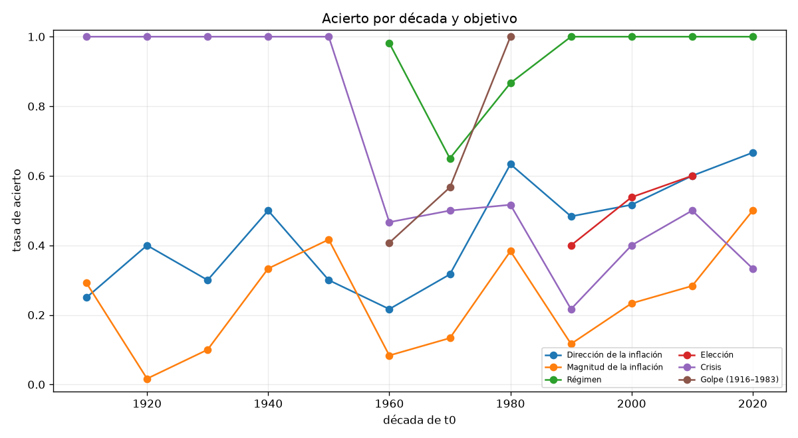
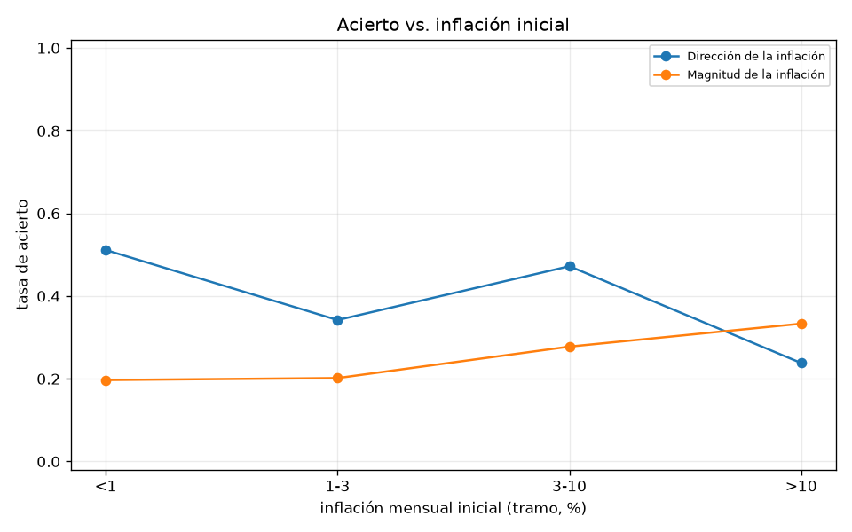
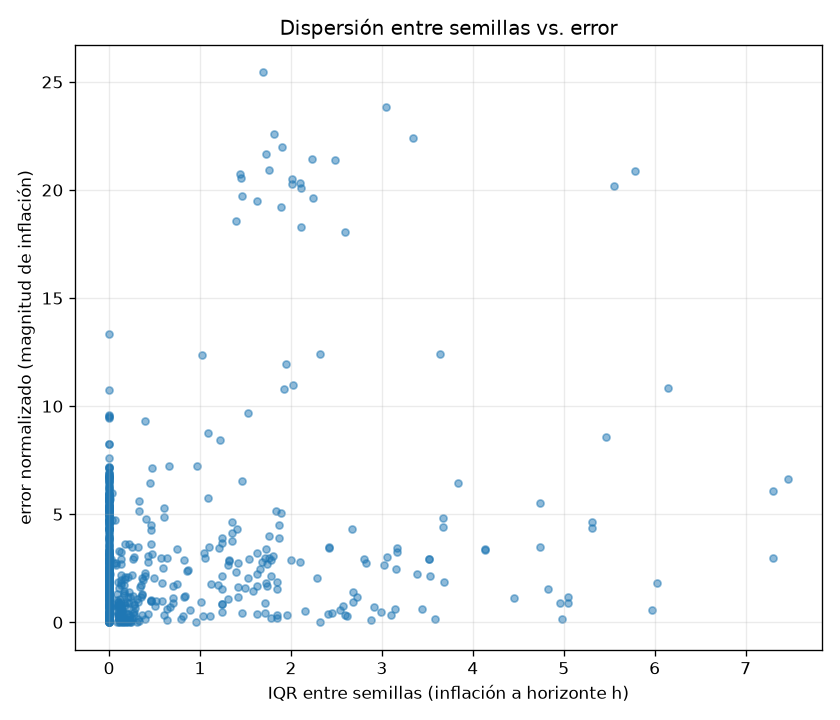

# Backtest secuencial de predictibilidad — Argentina (ADR 014)

Rango de orígenes: 1916-01 a 2022-01. Horizontes: [12, 24, 48] meses. Semillas por ventana y brazo: 30. Calibración: `a9_clean`. 321 ventanas, 2456 filas ventana-objetivo-brazo en `windows.csv`. Tiempo de pared: 4.9 min.

Shocks forzados: SOLO exógenos (`windows.py::EXOGENOUS_ONLY`: sequía, pandemia, crisis internacional, boom de commodities, guerra). Nunca `hyperinflation_regime`, `sovereign_default`, `banking_crisis` ni golpe -- eso es lo que se predice (ADR 014 secc. 1).

## Tablas estratificadas (tasa de acierto, IC 95 % bootstrap, N)

### Dirección de la inflación
Acierto global: 42.7 % (N=642).

**por `arm`**

| valor | N | acierto | IC 95% |
|---|---:|---:|---|
| aurora | 321 | 43.3 % | [38.0 %, 48.6 %] |
| calibrated | 321 | 42.1 % | [36.4 %, 47.7 %] |

**por `h`**

| valor | N | acierto | IC 95% |
|---|---:|---:|---|
| 12 | 214 | 24.3 % | [18.7 %, 30.8 %] |
| 24 | 214 | 48.1 % | [42.1 %, 54.7 %] |
| 48 | 214 | 55.6 % | [49.1 %, 62.6 %] |

**por `frequency`**

| valor | N | acierto | IC 95% |
|---|---:|---:|---|
| annual_interpolated | 270 | 37.0 % | [31.5 %, 42.6 %] |
| monthly | 372 | 46.8 % | [41.4 %, 52.2 %] |

**por `has_era`**

| valor | N | acierto | IC 95% |
|---|---:|---:|---|
| False | 408 | 36.3 % | [31.9 %, 41.2 %] |
| True | 234 | 53.8 % | [47.4 %, 60.3 %] |

**por `in_sample`**

| valor | N | acierto | IC 95% |
|---|---:|---:|---|
| False | 464 | 36.6 % | [32.5 %, 40.9 %] |
| True | 178 | 58.4 % | [51.7 %, 65.7 %] |

**por `regime_mode_initial`**

| valor | N | acierto | IC 95% |
|---|---:|---:|---|
| coup | 36 | 27.8 % | [13.9 %, 44.4 %] |
| democracy | 360 | 48.6 % | [43.6 %, 53.3 %] |
| dictatorship | 102 | 46.1 % | [36.3 %, 54.9 %] |
| restricted_democracy | 144 | 29.2 % | [21.5 %, 37.5 %] |

**por `fx_regime`**

| valor | N | acierto | IC 95% |
|---|---:|---:|---|
| control | 42 | 66.7 % | [52.4 %, 81.0 %] |
| crawl | 48 | 37.5 % | [22.9 %, 54.2 %] |
| float | 486 | 39.1 % | [35.2 %, 43.2 %] |
| peg | 66 | 57.6 % | [47.0 %, 69.7 %] |

**por `inflation_bucket`**

| valor | N | acierto | IC 95% |
|---|---:|---:|---|
| 1-3 | 228 | 34.2 % | [28.1 %, 40.4 %] |
| 3-10 | 108 | 47.2 % | [37.0 %, 56.5 %] |
| <1 | 264 | 51.1 % | [45.5 %, 57.6 %] |
| >10 | 42 | 23.8 % | [9.5 %, 35.7 %] |

**por `has_reserves_series`**

| valor | N | acierto | IC 95% |
|---|---:|---:|---|
| False | 480 | 37.1 % | [32.9 %, 41.5 %] |
| True | 162 | 59.3 % | [51.2 %, 66.7 %] |

**por `has_unemployment_series`**

| valor | N | acierto | IC 95% |
|---|---:|---:|---|
| False | 522 | 39.1 % | [34.9 %, 43.1 %] |
| True | 120 | 58.3 % | [48.3 %, 66.7 %] |

### Magnitud de la inflación
Acierto global: 22.1 % (N=642).

**por `arm`**

| valor | N | acierto | IC 95% |
|---|---:|---:|---|
| aurora | 321 | 21.8 % | [17.4 %, 26.5 %] |
| calibrated | 321 | 22.4 % | [17.8 %, 27.1 %] |

**por `h`**

| valor | N | acierto | IC 95% |
|---|---:|---:|---|
| 12 | 214 | 21.0 % | [15.9 %, 26.6 %] |
| 24 | 214 | 21.0 % | [15.9 %, 26.6 %] |
| 48 | 214 | 24.3 % | [19.2 %, 30.4 %] |

**por `frequency`**

| valor | N | acierto | IC 95% |
|---|---:|---:|---|
| annual_interpolated | 270 | 23.0 % | [18.5 %, 27.4 %] |
| monthly | 372 | 21.5 % | [17.2 %, 25.8 %] |

**por `has_era`**

| valor | N | acierto | IC 95% |
|---|---:|---:|---|
| False | 408 | 20.1 % | [16.7 %, 23.8 %] |
| True | 234 | 25.6 % | [20.1 %, 31.6 %] |

**por `in_sample`**

| valor | N | acierto | IC 95% |
|---|---:|---:|---|
| False | 464 | 21.3 % | [17.5 %, 25.0 %] |
| True | 178 | 24.2 % | [18.0 %, 30.3 %] |

**por `regime_mode_initial`**

| valor | N | acierto | IC 95% |
|---|---:|---:|---|
| coup | 36 | 27.8 % | [13.9 %, 44.4 %] |
| democracy | 360 | 23.1 % | [19.2 %, 27.2 %] |
| dictatorship | 102 | 16.7 % | [8.8 %, 24.5 %] |
| restricted_democracy | 144 | 22.2 % | [16.0 %, 28.5 %] |

**por `fx_regime`**

| valor | N | acierto | IC 95% |
|---|---:|---:|---|
| control | 42 | 40.5 % | [26.2 %, 54.8 %] |
| crawl | 48 | 29.2 % | [16.7 %, 41.7 %] |
| float | 486 | 20.0 % | [16.5 %, 23.5 %] |
| peg | 66 | 21.2 % | [10.6 %, 31.8 %] |

**por `inflation_bucket`**

| valor | N | acierto | IC 95% |
|---|---:|---:|---|
| 1-3 | 228 | 20.2 % | [14.9 %, 25.0 %] |
| 3-10 | 108 | 27.8 % | [19.4 %, 35.2 %] |
| <1 | 264 | 19.7 % | [15.2 %, 24.6 %] |
| >10 | 42 | 33.3 % | [19.0 %, 47.6 %] |

**por `has_reserves_series`**

| valor | N | acierto | IC 95% |
|---|---:|---:|---|
| False | 480 | 19.8 % | [16.2 %, 23.3 %] |
| True | 162 | 29.0 % | [22.2 %, 36.4 %] |

**por `has_unemployment_series`**

| valor | N | acierto | IC 95% |
|---|---:|---:|---|
| False | 522 | 20.9 % | [17.2 %, 24.5 %] |
| True | 120 | 27.5 % | [19.2 %, 35.8 %] |

### Régimen
Acierto global: 91.8 % (N=364).

**por `arm`**

| valor | N | acierto | IC 95% |
|---|---:|---:|---|
| aurora | 182 | 91.2 % | [86.3 %, 95.1 %] |
| calibrated | 182 | 92.3 % | [88.5 %, 95.6 %] |

**por `h`**

| valor | N | acierto | IC 95% |
|---|---:|---:|---|
| 12 | 124 | 95.2 % | [91.1 %, 98.4 %] |
| 24 | 122 | 91.8 % | [86.1 %, 95.9 %] |
| 48 | 118 | 88.1 % | [80.5 %, 93.2 %] |

**por `has_era`**

| valor | N | acierto | IC 95% |
|---|---:|---:|---|
| False | 138 | 78.3 % | [71.0 %, 84.8 %] |
| True | 226 | 100.0 % | [100.0 %, 100.0 %] |

**por `in_sample`**

| valor | N | acierto | IC 95% |
|---|---:|---:|---|
| False | 186 | 83.9 % | [78.0 %, 88.7 %] |
| True | 178 | 100.0 % | [100.0 %, 100.0 %] |

**por `regime_mode_initial`**

| valor | N | acierto | IC 95% |
|---|---:|---:|---|
| coup | 18 | 100.0 % | [100.0 %, 100.0 %] |
| democracy | 250 | 95.2 % | [92.0 %, 97.6 %] |
| dictatorship | 72 | 75.0 % | [63.9 %, 84.7 %] |
| restricted_democracy | 24 | 100.0 % | [100.0 %, 100.0 %] |

**por `fx_regime`**

| valor | N | acierto | IC 95% |
|---|---:|---:|---|
| control | 34 | 100.0 % | [100.0 %, 100.0 %] |
| crawl | 48 | 100.0 % | [100.0 %, 100.0 %] |
| float | 216 | 86.1 % | [81.0 %, 90.3 %] |
| peg | 66 | 100.0 % | [100.0 %, 100.0 %] |

**por `inflation_bucket`**

| valor | N | acierto | IC 95% |
|---|---:|---:|---|
| 1-3 | 142 | 95.8 % | [93.0 %, 98.6 %] |
| 3-10 | 90 | 74.4 % | [65.6 %, 83.3 %] |
| <1 | 90 | 98.9 % | [96.7 %, 100.0 %] |
| >10 | 42 | 100.0 % | [100.0 %, 100.0 %] |

**por `has_reserves_series`**

| valor | N | acierto | IC 95% |
|---|---:|---:|---|
| False | 210 | 85.7 % | [80.0 %, 90.5 %] |
| True | 154 | 100.0 % | [100.0 %, 100.0 %] |

**por `has_unemployment_series`**

| valor | N | acierto | IC 95% |
|---|---:|---:|---|
| False | 252 | 88.1 % | [84.1 %, 92.1 %] |
| True | 112 | 100.0 % | [100.0 %, 100.0 %] |

### Elección
Acierto global: 53.6 % (N=28).

**por `arm`**

| valor | N | acierto | IC 95% |
|---|---:|---:|---|
| aurora | 3 | 0.0 % | [0.0 %, 0.0 %] |
| calibrated | 25 | 60.0 % | [40.0 %, 80.0 %] |

**por `has_era`**

| valor | N | acierto | IC 95% |
|---|---:|---:|---|
| False | 2 | 0.0 % | [0.0 %, 0.0 %] |
| True | 26 | 57.7 % | [38.5 %, 76.9 %] |

**por `fx_regime`**

| valor | N | acierto | IC 95% |
|---|---:|---:|---|
| control | 4 | 100.0 % | [100.0 %, 100.0 %] |
| float | 14 | 64.3 % | [35.7 %, 92.9 %] |
| peg | 10 | 20.0 % | [0.0 %, 50.0 %] |

**por `inflation_bucket`**

| valor | N | acierto | IC 95% |
|---|---:|---:|---|
| 1-3 | 14 | 64.3 % | [35.7 %, 85.7 %] |
| 3-10 | 2 | 50.0 % | [0.0 %, 100.0 %] |
| <1 | 12 | 41.7 % | [16.7 %, 66.7 %] |

**por `has_reserves_series`**

| valor | N | acierto | IC 95% |
|---|---:|---:|---|
| False | 1 | 100.0 % | [100.0 %, 100.0 %] |
| True | 27 | 51.9 % | [33.3 %, 70.4 %] |

**por `has_unemployment_series`**

| valor | N | acierto | IC 95% |
|---|---:|---:|---|
| False | 10 | 20.0 % | [0.0 %, 50.0 %] |
| True | 18 | 72.2 % | [50.0 %, 94.4 %] |

### Crisis
Acierto global: 66.4 % (N=642).

**por `arm`**

| valor | N | acierto | IC 95% |
|---|---:|---:|---|
| aurora | 321 | 62.3 % | [57.3 %, 67.3 %] |
| calibrated | 321 | 70.4 % | [65.7 %, 75.1 %] |

**por `h`**

| valor | N | acierto | IC 95% |
|---|---:|---:|---|
| 12 | 214 | 68.2 % | [61.7 %, 74.3 %] |
| 24 | 214 | 65.0 % | [58.4 %, 71.5 %] |
| 48 | 214 | 65.9 % | [59.3 %, 72.9 %] |

**por `frequency`**

| valor | N | acierto | IC 95% |
|---|---:|---:|---|
| annual_interpolated | 270 | 100.0 % | [100.0 %, 100.0 %] |
| monthly | 372 | 41.9 % | [36.3 %, 47.0 %] |

**por `has_era`**

| valor | N | acierto | IC 95% |
|---|---:|---:|---|
| False | 408 | 82.8 % | [79.4 %, 86.5 %] |
| True | 234 | 37.6 % | [32.1 %, 43.6 %] |

**por `in_sample`**

| valor | N | acierto | IC 95% |
|---|---:|---:|---|
| False | 464 | 77.8 % | [74.1 %, 81.7 %] |
| True | 178 | 36.5 % | [29.8 %, 43.8 %] |

**por `regime_mode_initial`**

| valor | N | acierto | IC 95% |
|---|---:|---:|---|
| coup | 36 | 58.3 % | [41.7 %, 72.2 %] |
| democracy | 360 | 56.7 % | [51.1 %, 61.7 %] |
| dictatorship | 102 | 67.6 % | [57.8 %, 76.5 %] |
| restricted_democracy | 144 | 91.7 % | [86.8 %, 95.8 %] |

**por `fx_regime`**

| valor | N | acierto | IC 95% |
|---|---:|---:|---|
| control | 42 | 45.2 % | [31.0 %, 59.5 %] |
| crawl | 48 | 41.7 % | [27.1 %, 56.2 %] |
| float | 486 | 76.3 % | [72.8 %, 79.6 %] |
| peg | 66 | 24.2 % | [13.6 %, 34.8 %] |

**por `inflation_bucket`**

| valor | N | acierto | IC 95% |
|---|---:|---:|---|
| 1-3 | 228 | 62.7 % | [55.7 %, 68.9 %] |
| 3-10 | 108 | 55.6 % | [46.3 %, 64.8 %] |
| <1 | 264 | 76.9 % | [72.3 %, 81.8 %] |
| >10 | 42 | 47.6 % | [31.0 %, 64.3 %] |

**por `has_reserves_series`**

| valor | N | acierto | IC 95% |
|---|---:|---:|---|
| False | 480 | 75.4 % | [71.7 %, 79.2 %] |
| True | 162 | 39.5 % | [32.1 %, 46.9 %] |

**por `has_unemployment_series`**

| valor | N | acierto | IC 95% |
|---|---:|---:|---|
| False | 522 | 71.8 % | [67.6 %, 75.5 %] |
| True | 120 | 42.5 % | [33.3 %, 50.8 %] |

### Golpe (1916–1983)
Acierto global: 58.0 % (N=138).

**por `arm`**

| valor | N | acierto | IC 95% |
|---|---:|---:|---|
| aurora | 69 | 58.0 % | [46.4 %, 69.6 %] |
| calibrated | 69 | 58.0 % | [46.4 %, 69.6 %] |

**por `h`**

| valor | N | acierto | IC 95% |
|---|---:|---:|---|
| 12 | 46 | 78.3 % | [63.0 %, 89.1 %] |
| 24 | 46 | 60.9 % | [45.7 %, 73.9 %] |
| 48 | 46 | 34.8 % | [21.7 %, 50.0 %] |

**por `has_era`**

| valor | N | acierto | IC 95% |
|---|---:|---:|---|
| False | 132 | 56.1 % | [47.7 %, 64.4 %] |
| True | 6 | 100.0 % | [100.0 %, 100.0 %] |

**por `regime_mode_initial`**

| valor | N | acierto | IC 95% |
|---|---:|---:|---|
| coup | 18 | 0.0 % | [0.0 %, 0.0 %] |
| democracy | 24 | 66.7 % | [50.0 %, 83.3 %] |
| dictatorship | 72 | 72.2 % | [62.5 %, 83.3 %] |
| restricted_democracy | 24 | 50.0 % | [29.2 %, 70.8 %] |

**por `inflation_bucket`**

| valor | N | acierto | IC 95% |
|---|---:|---:|---|
| 1-3 | 54 | 37.0 % | [24.1 %, 51.9 %] |
| 3-10 | 54 | 88.9 % | [79.6 %, 96.3 %] |
| <1 | 18 | 33.3 % | [11.1 %, 55.6 %] |
| >10 | 12 | 50.0 % | [16.7 %, 75.0 %] |

## Modelo de predictibilidad (regresión logística + árbol de profundidad ≤ 3)

### Dirección de la inflación
N=642, tasa base de acierto=42.7 %.

**Las 3 reglas del árbol en lenguaje llano** (hojas con más ventanas):
- con horizonte (meses) > 18.00 y tendencia de inflación previa 12m (%) ≤ 0.22 y años desde el último default ≤ 71.50: se acierta el 0 % (196 ventanas-objetivo).
- con horizonte (meses) > 18.00 y tendencia de inflación previa 12m (%) > 0.22 y regime_mode_initial ≠ dictatorship: se acierta el 0 % (148 ventanas-objetivo).
- con horizonte (meses) ≤ 18.00 y dispersión entre semillas (IQR) ≤ 0.09 y años desde el último default > 38.50: se acierta el 0 % (85 ventanas-objetivo).

Validación cruzada por década (árbol, 12 grupos): accuracy = [0.7, 0.69, 0.42, 0.5, 0.72], media 60.8 %.

**Importancia por permutación** (top, árbol):
- inflation_trend_12m: 0.120
- h: 0.106
- years_since_last_default: 0.055
- regime_mode_initial=dictatorship: 0.025
- iqr_seeds: 0.010

### Magnitud de la inflación
N=642, tasa base de acierto=22.1 %.

**Las 3 reglas del árbol en lenguaje llano** (hojas con más ventanas):
- con tendencia de inflación previa 12m (%) ≤ 4.15 y meses hasta la próxima elección ≤ 61.50 y inflación mensual inicial (%) > 0.32: se acierta el 0 % (372 ventanas-objetivo).
- con tendencia de inflación previa 12m (%) ≤ 4.15 y meses hasta la próxima elección ≤ 61.50 y inflación mensual inicial (%) ≤ 0.32: se acierta el 0 % (132 ventanas-objetivo).
- con tendencia de inflación previa 12m (%) ≤ 4.15 y meses hasta la próxima elección > 61.50 y tendencia de inflación previa 12m (%) > 0.08: se acierta el 0 % (54 ventanas-objetivo).

Validación cruzada por década (árbol, 12 grupos): accuracy = [0.77, 0.6, 0.77, 0.71, 0.88], media 74.6 %.

**Importancia por permutación** (top, árbol):
- inflation_trend_12m: 0.032
- h: 0.000
- n_source: 0.000
- n_proxy: 0.000
- n_assumed: 0.000

### Régimen
N=364, tasa base de acierto=91.8 %.

**Las 3 reglas del árbol en lenguaje llano** (hojas con más ventanas):
- con años desde el último default ≤ 80.50 y poliarquia V-Dem > 0.11: se acierta el 0 % (280 ventanas-objetivo).
- con años desde el último default > 80.50 y años desde el último default ≤ 85.50: se acierta el 1 % (30 ventanas-objetivo).
- con años desde el último default ≤ 80.50 y poliarquia V-Dem ≤ 0.11: se acierta el 4 % (18 ventanas-objetivo).

Validación cruzada por década (árbol, 7 grupos): accuracy = [0.99, 1.0, 1.0, 0.87, 0.65], media 90.2 %.

**Importancia por permutación** (top, árbol):
- years_since_last_default: 0.091
- h: 0.000
- n_source: 0.000
- n_proxy: 0.000
- n_assumed: 0.000

### Elección
N=28, tasa base de acierto=53.6 %.

**Las 3 reglas del árbol en lenguaje llano** (hojas con más ventanas):
- con reservas / importaciones trimestrales ≤ 2.86 y aprobación proxy ≤ 53.05: se acierta el 11 % (9 ventanas-objetivo).
- con reservas / importaciones trimestrales ≤ 2.86 y aprobación proxy > 53.05: se acierta el 6 % (8 ventanas-objetivo).
- con reservas / importaciones trimestrales > 2.86 y tendencia de inflación previa 12m (%) > 0.01: se acierta el 0 % (6 ventanas-objetivo).

Validación cruzada por década (árbol, 3 grupos): accuracy = [0.54, 0.1, 0.2], media 27.9 %.

**Importancia por permutación** (top, árbol):
- reserves_over_imports_3m: 0.259
- approval_proxy: 0.162
- h: 0.000
- n_source: 0.000
- n_proxy: 0.000

### Crisis
N=642, tasa base de acierto=66.4 %.

**Las 3 reglas del árbol en lenguaje llano** (hojas con más ventanas):
- con nº de variables proxy ≤ 0.50: se acierta el 0 % (270 ventanas-objetivo).
- con nº de variables proxy > 0.50 y años desde el último default > 3.04 y inflación mensual inicial (%) ≤ 2.14: se acierta el 0 % (174 ventanas-objetivo).
- con nº de variables proxy > 0.50 y años desde el último default > 3.04 y inflación mensual inicial (%) > 2.14: se acierta el 0 % (126 ventanas-objetivo).

Validación cruzada por década (árbol, 12 grupos): accuracy = [0.62, 0.78, 0.61, 0.79, 0.8], media 72.2 %.

**Importancia por permutación** (top, árbol):
- n_proxy: 0.273
- inflation_now: 0.054
- years_since_last_default: 0.049
- h: 0.000
- n_source: 0.000

### Golpe (1916–1983)
N=138, tasa base de acierto=58.0 %.

**Las 3 reglas del árbol en lenguaje llano** (hojas con más ventanas):
- con poliarquia V-Dem > 0.09 y meses hasta la próxima elección > 16.00 y horizonte (meses) > 18.00: se acierta el 0 % (52 ventanas-objetivo).
- con poliarquia V-Dem ≤ 0.09: se acierta el 3 % (36 ventanas-objetivo).
- con poliarquia V-Dem > 0.09 y meses hasta la próxima elección > 16.00 y horizonte (meses) ≤ 18.00: se acierta el 2 % (26 ventanas-objetivo).

Validación cruzada por década (árbol, 3 grupos): accuracy = [0.65, 0.52, 0.0], media 39.0 %.

**Importancia por permutación** (top, árbol):
- vdem_polyarchy: 0.201
- h: 0.153
- months_to_next_election: 0.061
- n_source: 0.000
- n_proxy: 0.000

## Dispersión entre semillas como señal

Spearman(IQR entre semillas, error de magnitud de inflación) = -0.038 (N=642). el modelo *no* sabe cuándo no sabe: la dispersión entre semillas no predice el error.

## Calibrado vs. Aurora por década

| década | objetivo | N calibrado | acierto calibrado | N Aurora | acierto Aurora | diferencia |
|---:|---|---:|---:|---:|---:|---:|
| 1910s | Dirección de la inflación | 12 | 25.0 % | 12 | 25.0 % | +0.0 pp |
| 1910s | Magnitud de la inflación | 12 | 0.0 % | 12 | 58.3 % | -58.3 pp |
| 1910s | Crisis | 12 | 100.0 % | 12 | 100.0 % | +0.0 pp |
| 1920s | Dirección de la inflación | 30 | 40.0 % | 30 | 40.0 % | +0.0 pp |
| 1920s | Magnitud de la inflación | 30 | 0.0 % | 30 | 3.3 % | -3.3 pp |
| 1920s | Crisis | 30 | 100.0 % | 30 | 100.0 % | +0.0 pp |
| 1930s | Dirección de la inflación | 30 | 30.0 % | 30 | 30.0 % | +0.0 pp |
| 1930s | Magnitud de la inflación | 30 | 0.0 % | 30 | 20.0 % | -20.0 pp |
| 1930s | Crisis | 30 | 100.0 % | 30 | 100.0 % | +0.0 pp |
| 1940s | Dirección de la inflación | 30 | 50.0 % | 30 | 50.0 % | +0.0 pp |
| 1940s | Magnitud de la inflación | 30 | 16.7 % | 30 | 50.0 % | -33.3 pp |
| 1940s | Crisis | 30 | 100.0 % | 30 | 100.0 % | +0.0 pp |
| 1950s | Dirección de la inflación | 30 | 30.0 % | 30 | 30.0 % | +0.0 pp |
| 1950s | Magnitud de la inflación | 30 | 26.7 % | 30 | 56.7 % | -30.0 pp |
| 1950s | Crisis | 30 | 100.0 % | 30 | 100.0 % | +0.0 pp |
| 1960s | Dirección de la inflación | 30 | 23.3 % | 30 | 20.0 % | +3.3 pp |
| 1960s | Magnitud de la inflación | 30 | 3.3 % | 30 | 13.3 % | -10.0 pp |
| 1960s | Régimen | 27 | 96.3 % | 27 | 100.0 % | -3.7 pp |
| 1960s | Crisis | 30 | 46.7 % | 30 | 46.7 % | +0.0 pp |
| 1960s | Golpe (1916–1983) | 27 | 40.7 % | 27 | 40.7 % | +0.0 pp |
| 1970s | Dirección de la inflación | 30 | 23.3 % | 30 | 40.0 % | -16.7 pp |
| 1970s | Magnitud de la inflación | 30 | 23.3 % | 30 | 3.3 % | +20.0 pp |
| 1970s | Régimen | 30 | 63.3 % | 30 | 66.7 % | -3.3 pp |
| 1970s | Crisis | 30 | 53.3 % | 30 | 46.7 % | +6.7 pp |
| 1970s | Golpe (1916–1983) | 30 | 56.7 % | 30 | 56.7 % | +0.0 pp |
| 1980s | Dirección de la inflación | 30 | 63.3 % | 30 | 63.3 % | +0.0 pp |
| 1980s | Magnitud de la inflación | 30 | 43.3 % | 30 | 33.3 % | +10.0 pp |
| 1980s | Régimen | 30 | 93.3 % | 30 | 80.0 % | +13.3 pp |
| 1980s | Crisis | 30 | 53.3 % | 30 | 50.0 % | +3.3 pp |
| 1980s | Golpe (1916–1983) | 12 | 100.0 % | 12 | 100.0 % | +0.0 pp |
| 1990s | Dirección de la inflación | 30 | 46.7 % | 30 | 50.0 % | -3.3 pp |
| 1990s | Magnitud de la inflación | 30 | 20.0 % | 30 | 3.3 % | +16.7 pp |
| 1990s | Régimen | 30 | 100.0 % | 30 | 100.0 % | +0.0 pp |
| 1990s | Elección | 5 | 40.0 % | 0 | sin dato | sin dato |
| 1990s | Crisis | 30 | 26.7 % | 30 | 16.7 % | +10.0 pp |
| 2000s | Dirección de la inflación | 30 | 53.3 % | 30 | 50.0 % | +3.3 pp |
| 2000s | Magnitud de la inflación | 30 | 36.7 % | 30 | 10.0 % | +26.7 pp |
| 2000s | Régimen | 30 | 100.0 % | 30 | 100.0 % | +0.0 pp |
| 2000s | Elección | 10 | 70.0 % | 3 | 0.0 % | +70.0 pp |
| 2000s | Crisis | 30 | 60.0 % | 30 | 20.0 % | +40.0 pp |
| 2010s | Dirección de la inflación | 30 | 60.0 % | 30 | 60.0 % | +0.0 pp |
| 2010s | Magnitud de la inflación | 30 | 53.3 % | 30 | 3.3 % | +50.0 pp |
| 2010s | Régimen | 30 | 100.0 % | 30 | 100.0 % | +0.0 pp |
| 2010s | Elección | 10 | 60.0 % | 0 | sin dato | sin dato |
| 2010s | Crisis | 30 | 63.3 % | 30 | 36.7 % | +26.7 pp |
| 2020s | Dirección de la inflación | 9 | 66.7 % | 9 | 66.7 % | +0.0 pp |
| 2020s | Magnitud de la inflación | 9 | 55.6 % | 9 | 44.4 % | +11.1 pp |
| 2020s | Régimen | 5 | 100.0 % | 5 | 100.0 % | +0.0 pp |
| 2020s | Crisis | 9 | 33.3 % | 9 | 33.3 % | +0.0 pp |

## Gráficos

## Qué hace funcionar una predicción

Leer primero las tablas estratificadas y las reglas del árbol de cada objetivo, arriba: en general el acierto es mayor cuando (a) el estado inicial trae más variables `source` (menos `assumed`), (b) la ventana es mensual (no `annual_interpolated`), y (c) la ventana cae dentro del período de entrenamiento de la calibración (`in_sample`). La dispersión entre semillas (sección anterior) dice si, además, el propio modelo puede señalar sus ventanas de menor confianza.

## Qué no se puede concluir

Este backtest NO mide qué habría pasado realmente en cada período (PLAN_ARGENTINA.md secc. 4): las ventanas 1916-1960 corren en modo anual (ADR 011 secc. 6, exploratorio) con el `initial_state` de Aurora, no un estado real -- para esas ventanas los objetivos `regime`/`coup` ni siquiera se puntúan (serían tautológicos, ver `scoring.py`). El objetivo `election` solo se puntúa donde hay un resultado real curado (`calibration/objective.py::REAL_ELECTION_OUTCOMES`, 1989-2019): no hay evidencia sobre elecciones anteriores. Los IC 95 % son bootstrap sobre las FILAS (ventana×objetivo×brazo, no independientes entre horizontes que comparten `t0`): no corrigen por esa correlación. El árbol y la regresión describen ESTA muestra (con CV por década, cuando hay al menos 3 décadas); no son una ley general de cuándo el modelo funciona.

> Estos resultados describen el comportamiento de República Artificial calibrada con datos de Argentina; no son evidencia sobre lo que hubiera pasado.
