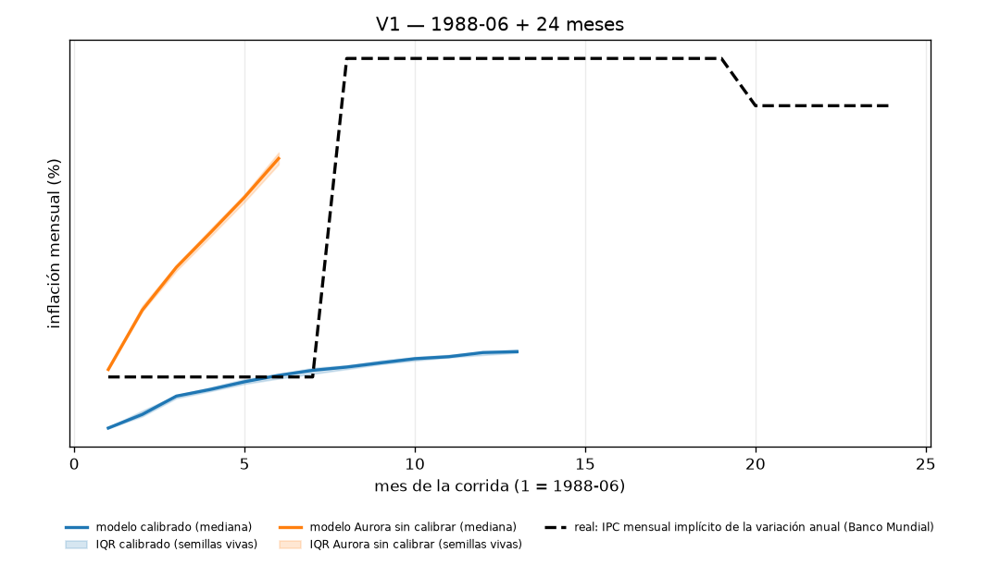
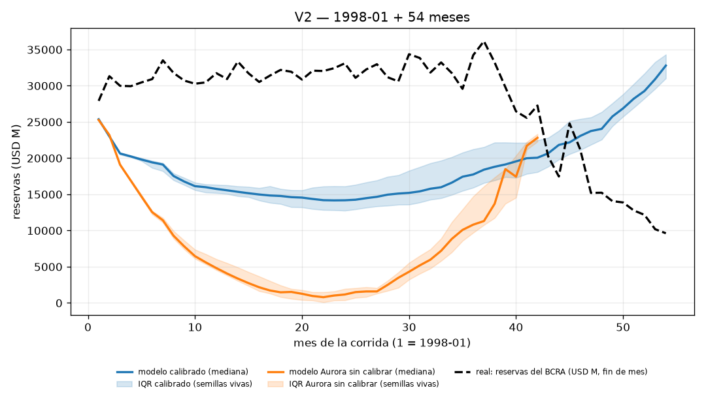
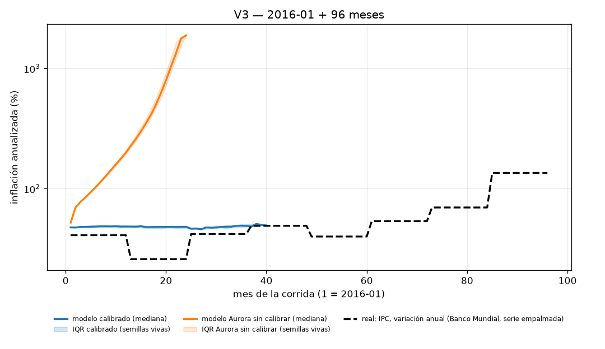
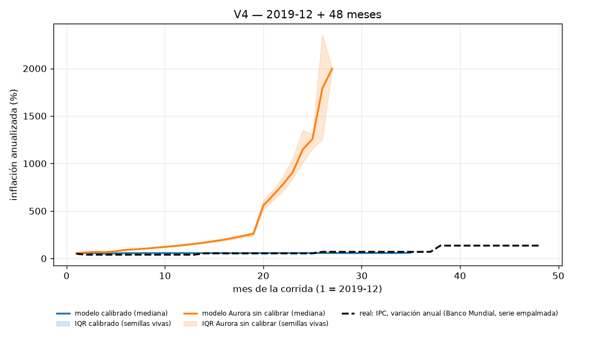

# Validación histórica de Argentina — ADR 012 secc. 6 (A5)

País: `argentina`. Calibración: `a5b_macro` (train `1992-01:2023-12`, holdout `1983-12:1991-12`). Macro (ADR 012): activo. Brazos: calibrado y **Aurora sin calibrar** (fila C del ADR).
Semillas por prueba y brazo: **50**. Tiempo de pared total: **52.5 s** (V1 7.4 s, V2 17.7 s, V3 13.4 s, V4 13.6 s).

Las hipótesis, los shocks forzados y la procedencia del estado inicial se registraron en `registration.json` **antes** de correr la primera simulación; este reporte solo las lee. Métricas crudas por prueba y brazo: `results.json`.

## Resumen: los 4 veredictos

| prueba | métrica principal | calibrado (`a5b_macro`) | Aurora sin calibrar | veredicto calibrado | veredicto Aurora |
|---|---|---|---|---|---|
| V1 | fracción de semillas en `hyperinflation` | 0.0 % IC95 [0.0 %, 0.0 %] | 100.0 % IC95 [100.0 %, 100.0 %] | **NO CUMPLIDA** | **CUMPLIDA** |
| V2 | fracción con `sovereign_default`/`collapse` en meses 36–54 | 56.0 % IC95 [42.0 %, 68.0 %] | 22.0 % IC95 [12.0 %, 34.0 %] | **CUMPLIDA** | **NO CUMPLIDA** |
| V3 | mediana de la inflación anualizada final (umbral 80 %) | 47.5 % IC95 [47.2 %, 48.6 %] | 1 709.8 % IC95 [1 601.4 %, 1 769.7 %] | **NO CUMPLIDA** | **NO CUMPLIDA** |
| V4 | inflación final (umbral 100 %) y derrota electoral (umbral 70 %) | infl 56.7 %, derrota 0.0 % IC95 [0.0 %, 0.0 %] | infl 1 319.4 %, derrota 0.0 % IC95 [0.0 %, 0.0 %] | **NO CUMPLIDA** | **NO CUMPLIDA** |

**C Control.** Hipótesis registrada (ADR 011 §8, literal): *Aurora sin calibrar falla al menos una de las tres*. Métrica: *la diferencia con el calibrado es el "valor" de la calibración*. Aurora sin calibrar falla 3 de 4 pruebas (V2, V3, V4): **CUMPLIDA**.

### El "valor" de la calibración (fila C del ADR)

La columna «real» es el dato histórico correspondiente y la última marca el brazo más cercano a ese dato métrica por métrica (independiente del veredicto binario de arriba).

| prueba | métrica | real | calibrado (`a3_main`) | Aurora sin calibrar | más cerca de la historia |
|---|---|---|---|---|---|
| V1 | fracción de semillas en `hyperinflation` (%) | 100.0 | 0.0 | 100.0 | **Aurora** |
| V1 | inflación mensual al mes 24 (%) — real jul-1989 ≈ 33 %/mes | 33.0 | 15.0 | 25.4 | **Aurora** |
| V2 | fracción con `sovereign_default`/`collapse` en meses 36–54 (%) | 100.0 | 56.0 | 22.0 | **calibrado** |
| V2 | RMSE de reservas vs real (USD M; baseline persistencia 4 342) | 0.0 | 14 874.9 | 26 098.3 | **calibrado** |
| V3 | inflación anualizada final (%) — real 2023: 135 % (BM) | 135.0 | 47.5 | 1 709.8 | **calibrado** |
| V3 | acierto electoral 2019-12 (oficialismo derrotado, % de semillas) | 100.0 | 0.0 | 0.0 | empate |
| V3 | acierto electoral 2023-12 (oficialismo derrotado, % de semillas) | 100.0 | 0.0 | 0.0 | empate |
| V3 | semillas que llegan al mes 96 sin `collapse` (%) | 100.0 | 0.0 | 100.0 | **Aurora** |

Notas puntuales: RMSE de reservas (V2) calibrado vs Aurora/persistencia: 43.0 % respecto de Aurora y -242.6 % respecto del baseline ingenuo de persistencia. Acierto electoral 2019 (V3): el acierto de la elección de 2019 pasa de 0.0 % a 0.0 % de las semillas. Supervivencia (V3): 50 de 50 semillas calibradas de V3 terminan en `collapse` antes del mes 96 y la elección de 2023 se celebra en 0 de 50. Ver la sección «Qué aprendimos del modelo» más abajo para la lectura mecánica completa.

## V1 1988→1990: ¿emerge la hiperinflación?

**Hipótesis registrada antes de correr (ADR 011 §8, literal):** *el modelo entra en `hyperinflation` en 12–24 meses en > 50 % de semillas*

**Métrica (ADR 011 §8, literal):** *fracción de semillas, mes mediano*

Corrida: `--country argentina --start 1988-06` × 24 meses × 50 semillas por brazo, `--historical-exogenous`, `--regime-mode auto`, política `passive`.

### Shocks forzados

- Shocks forzados que pide el ADR: *solo exógenos (commodities, mundo) — **no** se fuerza la hiper*.
- Shocks forzados efectivamente aplicados: **ninguno** (el ADR no pide forzar ninguno en esta prueba).
- Además siguen activos los shocks **aleatorios** de `shocks.json` (`shocks_enabled=True`, igual que en cualquier `republica run`): la lista de forzados no es la lista de shocks que ocurrieron.

### Procedencia del estado inicial

- Estado inicial `1988-06` (21 variables): **5 `source`**, **1 `proxy`**, **15 `assumed`**.
  - `source`: `gdp_growth`, `inflation`, `inflation_lag1`, `institutional_confidence`, `political_stability`
  - `proxy`: `government_approval`
  - `assumed`: `congress_support`, `consumer_confidence`, `crime_perception`, `exchange_rate`, `fiscal_balance`, `gdp`, `inequality`, `interest_rate`, `poverty`, `protest_level`, `public_debt`, `real_wage`, `reserves`, `social_tension`, `unemployment`

### Resultado

| brazo | fracción en `hyperinflation` | IC95 (bootstrap sobre semillas) | mes mediano | inflación mensual final (mediana) | outcomes |
|---|---|---|---|---|---|
| calibrado | 0.0 % | [0.0 %, 0.0 %] | sin dato | 14.97 % | {'collapse': 50} |
| Aurora sin calibrar | 100.0 % | [100.0 %, 100.0 %] | 6.0 | 25.36 % | {'hyperinflation': 50} |

**Veredicto (calibrado): NO CUMPLIDA.** **Veredicto (Aurora sin calibrar): CUMPLIDA.**

*Trayectoria mediana con banda intercuartil por brazo contra IPC mensual implícito de la variación anual (Banco Mundial). La banda se calcula solo sobre las semillas VIVAS en cada mes: una corrida terminada por `collapse`/`hyperinflation` deja de contribuir en vez de repetir su último valor.*

## V2 1998→2002: ¿colapso con convertibilidad rígida?

**Hipótesis registrada antes de correr (ADR 011 §8, literal):** *`sovereign_default` o `collapse` en 36–54 meses en > 50 %*

**Métrica (ADR 011 §8, literal):** *idem + trayectoria de reservas vs real*

Corrida: `--country argentina --start 1998-01` × 54 meses × 50 semillas por brazo, `--fx-regime peg`, `--historical-exogenous`, `--regime-mode auto`, política `passive`.

### Shocks forzados

- Shocks forzados que pide el ADR: *crisis internacional 1998–99 (Rusia, Brasil)*.
- `crisis internacional 1998–99 (Rusia, Brasil)` → `international_crisis` 1998-08 (mes 8, duración 17 meses — Contagio de la crisis rusa y devaluación brasileña (1998-99))
- `forced_shocks` pasado al motor: `{'8': ['international_crisis']}` (índice de mes → shock).
- Además siguen activos los shocks **aleatorios** de `shocks.json` (`shocks_enabled=True`, igual que en cualquier `republica run`): la lista de forzados no es la lista de shocks que ocurrieron.

### Procedencia del estado inicial

- Estado inicial `1998-01` (21 variables): **7 `source`**, **1 `proxy`**, **13 `assumed`**.
  - `source`: `gdp_growth`, `inflation`, `inflation_lag1`, `institutional_confidence`, `political_stability`, `public_debt`, `reserves`
  - `proxy`: `government_approval`
  - `assumed`: `congress_support`, `consumer_confidence`, `crime_perception`, `exchange_rate`, `fiscal_balance`, `gdp`, `inequality`, `interest_rate`, `poverty`, `protest_level`, `real_wage`, `social_tension`, `unemployment`

### Resultado

| brazo | fracción `sovereign_default`/`collapse` en meses 36–54 | IC95 | RMSE reservas vs real (USD M, mediana) | IC95 | outcomes |
|---|---|---|---|---|---|
| calibrado | 56.0 % | [42.0 %, 68.0 %] | 14 875 | [14 306, 15 237] | {'collapse': 37, 'survived': 13} |
| Aurora sin calibrar | 22.0 % | [12.0 %, 34.0 %] | 26 098 | [25 830, 26 161] | {'hyperinflation': 50} |

Baseline ingenuo de reservas (persistencia: reservas reales congeladas en el nivel real de 1998-01): RMSE 4 342 USD M.

**Veredicto (calibrado): CUMPLIDA.** **Veredicto (Aurora sin calibrar): NO CUMPLIDA.**

*Trayectoria mediana con banda intercuartil por brazo contra reservas del BCRA (USD M, fin de mes). La banda se calcula solo sobre las semillas VIVAS en cada mes: una corrida terminada por `collapse`/`hyperinflation` deja de contribuir en vez de repetir su último valor.*

## V3 2016→2023: ¿se acelera la inflación y pierde el oficialismo?

**Hipótesis registrada antes de correr (ADR 011 §8, literal):** *inflación anual final > 80 % en la mediana y el oficialismo pierde en 2019 y 2023*

**Métrica (ADR 011 §8, literal):** *error de inflación, aciertos electorales*

Corrida: `--country argentina --start 2016-01` × 96 meses × 50 semillas por brazo, `--historical-exogenous`, `--regime-mode auto`, política `passive`.

### Shocks forzados

- Shocks forzados que pide el ADR: *sequía 2018, pandemia 2020, sequía 2023*.
- `sequía 2018` → `drought` 2018-01 (mes 25, duración 6 meses — Sequía de la campaña 2017/2018)
- `pandemia 2020` → `epidemic` 2020-03 (mes 51, duración 24 meses — Pandemia de COVID-19 / ASPO)
- `sequía 2023` → `drought` 2023-01 (mes 85, duración 12 meses — Sequía histórica de la campaña 2022/2023)
- `forced_shocks` pasado al motor: `{'25': ['drought'], '51': ['epidemic'], '85': ['drought']}` (índice de mes → shock).
- Además siguen activos los shocks **aleatorios** de `shocks.json` (`shocks_enabled=True`, igual que en cualquier `republica run`): la lista de forzados no es la lista de shocks que ocurrieron.

### Procedencia del estado inicial

- Estado inicial `2016-01` (21 variables): **11 `source`**, **1 `proxy`**, **9 `assumed`**.
  - `source`: `fiscal_balance`, `gdp_growth`, `inflation`, `inflation_lag1`, `institutional_confidence`, `interest_rate`, `political_stability`, `poverty`, `public_debt`, `reserves`, `unemployment`
  - `proxy`: `government_approval`
  - `assumed`: `congress_support`, `consumer_confidence`, `crime_perception`, `exchange_rate`, `gdp`, `inequality`, `protest_level`, `real_wage`, `social_tension`

### Resultado

| brazo | inflación anualizada final (mediana) | IC95 | meses simulados (mediana) | outcomes |
|---|---|---|---|---|
| calibrado | 47.5 % | [47.2 %, 48.6 %] | 32 | {'collapse': 50} |
| Aurora sin calibrar | 1 709.8 % | [1 601.4 %, 1 769.7 %] | 22 | {'hyperinflation': 50} |

| elección | resultado real | brazo | semillas en que la elección ocurrió | aciertos | IC95 |
|---|---|---|---|---|---|
| 2019-12 | oficialismo derrotado | calibrado | 0 | 0.0 % | [0.0 %, 0.0 %] |
| 2019-12 | oficialismo derrotado | Aurora sin calibrar | 0 | 0.0 % | [0.0 %, 0.0 %] |
| 2023-12 | oficialismo derrotado | calibrado | 0 | 0.0 % | [0.0 %, 0.0 %] |
| 2023-12 | oficialismo derrotado | Aurora sin calibrar | 0 | 0.0 % | [0.0 %, 0.0 %] |

**Veredicto (calibrado): NO CUMPLIDA.** **Veredicto (Aurora sin calibrar): NO CUMPLIDA.**

*Trayectoria mediana con banda intercuartil por brazo contra IPC, variación anual (Banco Mundial, serie empalmada). La banda se calcula solo sobre las semillas VIVAS en cada mes: una corrida terminada por `collapse`/`hyperinflation` deja de contribuir en vez de repetir su último valor.*

## V4 2019-12→2023-12: ¿pierde el oficialismo con partidos argentinos?

**Hipótesis registrada antes de correr (A5, ADR 012 secc. 6, literal):** *el oficialismo pierde en > 70 % de semillas y la inflación anual final mediana supera 100 %*

**Métrica (A5, ADR 012 secc. 6, literal):** *fracción de semillas con derrota electoral, inflación anual final mediana*

Corrida: `--country argentina --start 2019-12` × 48 meses × 50 semillas por brazo, `--historical-exogenous`, `--regime-mode auto`, política `passive`.

### Shocks forzados

- Shocks forzados que pide el ADR: *pandemia 2020, sequía 2023, FMI 2022 (todos exógenos)*.
- `pandemia 2020` → `epidemic` 2020-03 (mes 4, duración 24 meses — Pandemia de COVID-19 / ASPO)
- `sequía 2023` → `drought` 2023-01 (mes 38, duración 12 meses — Sequía histórica de la campaña 2022/2023)
- `FMI 2022` → `imf_program` 2022-03 (mes 28, duración 30 meses — Acuerdo de Facilidades Extendidas con el FMI (2022))
- `forced_shocks` pasado al motor: `{'4': ['epidemic'], '28': ['imf_program'], '38': ['drought']}` (índice de mes → shock).
- Además siguen activos los shocks **aleatorios** de `shocks.json` (`shocks_enabled=True`, igual que en cualquier `republica run`): la lista de forzados no es la lista de shocks que ocurrieron.

### Procedencia del estado inicial

- Estado inicial `2019-12` (21 variables): **11 `source`**, **1 `proxy`**, **9 `assumed`**.
  - `source`: `fiscal_balance`, `gdp_growth`, `inflation`, `inflation_lag1`, `institutional_confidence`, `interest_rate`, `political_stability`, `poverty`, `public_debt`, `reserves`, `unemployment`
  - `proxy`: `government_approval`
  - `assumed`: `congress_support`, `consumer_confidence`, `crime_perception`, `exchange_rate`, `gdp`, `inequality`, `protest_level`, `real_wage`, `social_tension`

### Resultado

| brazo | inflación anualizada final (mediana) | IC95 | derrota electoral (cualquier elección de la ventana) | IC95 | meses simulados (mediana) | outcomes |
|---|---|---|---|---|---|---|
| calibrado | 56.7 % | [56.2 %, 57.4 %] | 0.0 % | [0.0 %, 0.0 %] | 29 | {'collapse': 50} |
| Aurora sin calibrar | 1 319.4 % | [1 277.2 %, 1 409.0 %] | 0.0 % | [0.0 %, 0.0 %] | 25 | {'collapse': 3, 'hyperinflation': 47} |

Semillas calibradas que terminan antes de los 48 meses (`collapse`/`hyperinflation`, la elección de fin de mandato puede no llegar a celebrarse): 50 de 50. Si esa fracción es alta, la hipótesis electoral de V4 no se puede evaluar con la misma confianza que la de inflación: en esas semillas la corrida termina antes de que se celebre la elección de fin de mandato.

**Veredicto (calibrado): NO CUMPLIDA.** **Veredicto (Aurora sin calibrar): NO CUMPLIDA.**

*Trayectoria mediana con banda intercuartil por brazo contra IPC, variación anual (Banco Mundial, serie empalmada). La banda se calcula solo sobre las semillas VIVAS en cada mes: una corrida terminada por `collapse`/`hyperinflation` deja de contribuir en vez de repetir su último valor.*

## Qué aprendimos del modelo (A5, ADR 012)

### V1 — hiperinflación

Con macro activo (ADR 012 secc. 2) la persistencia efectiva de la inflación es `rho_eff = rho_pi + rho_slope·clamp((inflation_lag1 - pi_hi)/pi_hi, 0, 2)`, no la `rho_pi + c_e` fija de la ecuación vieja (ADR 011): con inflación mensual alta `rho_eff` puede superar 1 (hiperinflación como régimen alcanzable, no un shock). Valores de esta corrida (`rho_pi`/`rho_slope`/`pi_hi`/`c_s`): Aurora `0.85`/`0.1`/`5`/`0.0045`, calibrado `0.5852`/`0.132`/`6.707`/`0.001524`.

Empíricamente, desde 1988-06 real (24 meses, sin shocks forzados): 0.0 % de semillas calibradas (IC95 [0.0 %, 0.0 %]) y 100.0 % de Aurora (IC95 [100.0 %, 100.0 %]) cruzan `hyperinflation`; inflación mensual mediana final: 14.97 % (calibrado) vs 25.36 % (Aurora), contra ~33 %/mes real de 1989 (Banco Mundial). Ver la tabla de arriba (Resumen) para el veredicto formal contra la hipótesis registrada.

### V2 — régimen cambiario y balance de pagos

Con macro activo, `fx_regime` gobierna `de` (secc. 3): `peg` fija `de=0` mientras `reserves > R_min = rm·importaciones_3m` e interviene vendiendo reservas; si `reserves < R_min` salta a `float` (`fx_regime_exit`, `shock_conf` negativo, `banking_crisis` con `exit_banking_crisis_p`). Las reservas (secc. 4) son `reserves' = reserves + current_account + capital_account - intervention_usd`, con `current_account`/`capital_account` dependientes de `commodity_price`/`rer`/`r_gap`/`dollar_demand`/`default_risk` -- ya no una caminata sin ancla. Diagnóstico empírico (`fx_regime_inertness`, 3 semillas): `peg` vs `float` dan trayectorias DISTINTAS (esperado con macro activo: `fx_regime` gobierna `de`, la intervención y `k_k` -- ADR 012 secc. 3).

Reservas: RMSE mediano calibrado 14 875 USD M contra 4 342 USD M del baseline de persistencia (congelar el nivel de 1998-01). Fracción con `sovereign_default`/`collapse` en meses 36-54: 56.0 % (IC95 [42.0 %, 68.0 %]). Ver la tabla de Resumen para el veredicto formal y `results.json` para la trayectoria completa de reservas.

### V3 — inflación y elecciones (in-sample, ver registro)

**Esta ventana (2016-01 + 96 meses) cae DENTRO del train de la calibración (`1992-01:2023-12`, A5) -- es in-sample, no una prueba de generalización** (ver `registration.json -> tests[].sample_declaration`). Un ajuste aquí puede reflejar sobreajuste al propio período, no una propiedad general del modelo.

Shocks exógenos forzados: `drought` 2018-01, `epidemic` 2020-03, `drought` 2023-01. Inflación anualizada final (mediana): 47.5 % (calibrado) vs 1 709.8 % (Aurora), contra ~135 % anual real en 2023 (Banco Mundial). Canal electoral (aprobación→cohortes→voto, sin cambios de ADR 012): aprobación mediana cae de 47 (2016-01) a 0 (fin de corrida); oficialismo pierde en 2019-12 en 0.0 % de semillas calibradas vs 0.0 % de Aurora. `collapse` en 50 de 50 semillas calibradas -- donde hay `collapse` la elección de 2023 no se celebra (ver `elections['2023-12'].n_held` en `results.json`, denominador real del acierto electoral de esa fecha).

### V4 — oficialismo y partidos por época (ADR 013)

Corrida desde 2019-12 con los partidos/actores/lealtades de la época 2015-2023 (ADR 013, integrado en paralelo -- LLA con `founded 2021`/`outsider_bonus`), NO los 29 actores fijos de Aurora. Inflación anualizada final (mediana): 56.7 % (calibrado) vs 1 319.4 % (Aurora), contra ~211 % anual real dic-2023 (INDEC, diciembre contra diciembre). Derrota electoral (cualquier elección de la ventana): 0.0 % (calibrado) vs 0.0 % (Aurora). Semillas calibradas que terminan antes de los 48 meses (`collapse`/`hyperinflation`): 50 de 50 -- si esa fracción es alta, la hipótesis electoral no se puede evaluar con la misma confianza que la de inflación (la corrida termina antes de que se celebre la elección de fin de mandato).

### Lo transversal

A diferencia de A4 (ADR 011), el motor con macro activo SI tiene los mecanismos no lineales que las tres pruebas necesitan (indexación que se acelera con la inflación, un régimen cambiario que puede romperse, reservas con balance de pagos real) -- ver los veredictos de la tabla de Resumen para si la MAGNITUD calibrada alcanza los umbrales registrados. Calibrar 155 coeficientes (97 económicos + 58 macro) sobre `1992-01:2023-12` no garantiza que los umbrales se crucen: los tres episodios extremos argentinos son eventos de cola, y la pérdida agregada (RMSE o cola pesada) puede preferir un ajuste que promedie bien sobre TODO el período en vez de uno que acierte los extremos.

## Qué NO se puede concluir

1. **Nada sobre la Argentina real.** Estas corridas dicen cómo se comporta República Artificial calibrada con datos argentinos. Una hipótesis NO CUMPLIDA es evidencia sobre el modelo, no sobre la historia.
2. **Que un veredicto NO CUMPLIDO signifique que el mecanismo sigue roto.** A diferencia de A4 (ADR 011), `rho_eff`/`fx_regime`/balance de pagos (ADR 012) SI afectan la simulación (ver `_lessons_section_macro` arriba y los tests de `tests/test_macro_regime.py`, que verifican el mecanismo de forma aislada); si una hipótesis no se cumple igual, es una cuestión de MAGNITUD/calibración, no de que el canal no exista.
3. **Que V3 (2016→2023) mida generalización.** Esta ventana está DENTRO del train de la calibración (`1992-01:2023-12`) -- es in-sample (ver `registration.json -> tests[].sample_declaration`). Solo V1 (1988→1990) está en el holdout real de esta calibración.
4. **Que los shocks forzados expliquen el resultado.** Los forzados están listados prueba por prueba arriba; un episodio reproducido en un mes con shock forzado no es mérito de la dinámica interna.
5. **Que el modelo «falle» la elección de 2023 en el brazo calibrado.** En las semillas que terminan en `collapse` antes del mes 96 la elección no llega a ocurrir: ese acierto mide supervivencia, no capacidad predictiva electoral.
6. **Que las elecciones del modelo sean las elecciones reales.** El motor las pone en múltiplos de `term_length` desde `--start` (2019-12 y 2023-12), no en octubre de 2019 y 2023, y no tiene noción de qué partido sintético corresponde a qué lista real: se compara sólo `reelected`/`defeated` (misma simplificación declarada en A3).
7. **Que estos números se generalicen a otras semillas o ventanas.** Los IC 95 % son bootstrap sobre las semillas de ESTA corrida: cubren la variabilidad de Monte Carlo, no la incertidumbre del estado inicial (con 9–15 de 21 variables `assumed`), ni la de los coeficientes, ni la del calendario de shocks.
8. **Que un `collapse` del motor sea «una crisis argentina».** `collapse` es `political_stability < 15` durante 3 meses, un umbral de diseño de Aurora sin calibración contra ningún evento histórico.

## Limitaciones

> Estos resultados describen el comportamiento de República Artificial calibrada con datos de Argentina; no son evidencia sobre lo que hubiera pasado.
