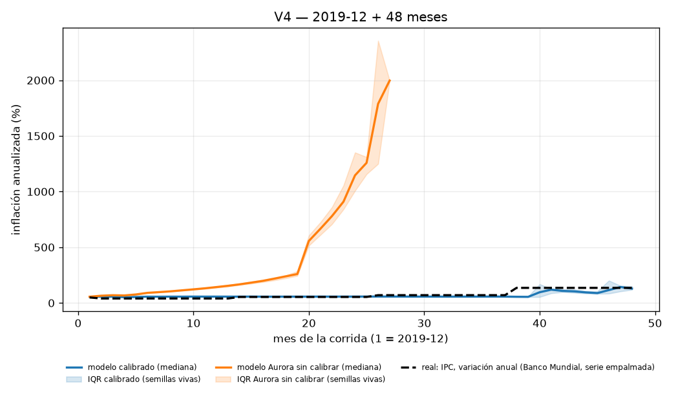

# Validación histórica de Argentina — ADR 012 secc. 6 (A5)

País: `argentina`. Calibración: `a5b_macro` (train `1992-01:2023-12`, holdout `1983-12:1991-12`). Macro (ADR 012): activo. Brazos: calibrado y **Aurora sin calibrar** (fila C del ADR).
Semillas por prueba y brazo: **50**. Tiempo de pared total: **13.0 s** (V4 12.9 s).

Las hipótesis, los shocks forzados y la procedencia del estado inicial se registraron en `registration.json` **antes** de correr la primera simulación; este reporte solo las lee. Métricas crudas por prueba y brazo: `results.json`.

## Resumen: los 1 veredicto

| prueba | métrica principal | calibrado (`a5b_macro`) | Aurora sin calibrar | veredicto calibrado | veredicto Aurora |
|---|---|---|---|---|---|
| V4 | inflación final (umbral 100 %) y derrota electoral (umbral 70 %) | infl 128.8 %, derrota 100.0 % IC95 [100.0 %, 100.0 %] | infl 1 319.4 %, derrota 0.0 % IC95 [0.0 %, 0.0 %] | **CUMPLIDA** | **NO CUMPLIDA** |

**C Control.** Hipótesis registrada (ADR 011 §8, literal): *Aurora sin calibrar falla al menos una de las tres*. Métrica: *la diferencia con el calibrado es el "valor" de la calibración*. Aurora sin calibrar falla 1 de 1 pruebas (V4): **CUMPLIDA**.

### El "valor" de la calibración (fila C del ADR)

La columna «real» es el dato histórico correspondiente y la última marca el brazo más cercano a ese dato métrica por métrica (independiente del veredicto binario de arriba).

| prueba | métrica | real | calibrado (`a3_main`) | Aurora sin calibrar | más cerca de la historia |
|---|---|---|---|---|---|

Notas puntuales: RMSE de reservas (V2) calibrado vs Aurora/persistencia: sin dato. Acierto electoral 2019 (V3): sin dato. Supervivencia (V3): sin dato. Ver la sección «Qué aprendimos del modelo» más abajo para la lectura mecánica completa.

## V4 2019-12→2023-12: ¿pierde el oficialismo con partidos argentinos?

**Hipótesis registrada antes de correr (A5, ADR 012 secc. 6, literal):** *el oficialismo pierde en > 70 % de semillas y la inflación anual final mediana supera 100 %*

**Métrica (A5, ADR 012 secc. 6, literal):** *fracción de semillas con derrota electoral, inflación anual final mediana*

Corrida: `--country argentina --start 2019-12` × 48 meses × 50 semillas por brazo, `--historical-exogenous`, `--regime-mode auto`, política `passive`.

### Shocks forzados

- Shocks forzados que pide el ADR: *pandemia 2020, sequía 2023, FMI 2022 (todos exógenos)*.
- `pandemia 2020` → `epidemic` 2020-03 (mes 4, duración 24 meses — Pandemia de COVID-19 / ASPO)
- `sequía 2023` → `drought` 2023-01 (mes 38, duración 12 meses — Sequía histórica de la campaña 2022/2023)
- `FMI 2022` → `imf_program` 2022-03 (mes 28, duración 30 meses — Acuerdo de Facilidades Extendidas con el FMI (2022))
- `forced_shocks` pasado al motor: `{'4': ['epidemic'], '28': ['imf_program'], '38': ['drought']}` (índice de mes → shock).
- Además siguen activos los shocks **aleatorios** de `shocks.json` (`shocks_enabled=True`, igual que en cualquier `republica run`): la lista de forzados no es la lista de shocks que ocurrieron.

### Procedencia del estado inicial

- Estado inicial `2019-12` (21 variables): **11 `source`**, **1 `proxy`**, **9 `assumed`**.
  - `source`: `fiscal_balance`, `gdp_growth`, `inflation`, `inflation_lag1`, `institutional_confidence`, `interest_rate`, `political_stability`, `poverty`, `public_debt`, `reserves`, `unemployment`
  - `proxy`: `government_approval`
  - `assumed`: `congress_support`, `consumer_confidence`, `crime_perception`, `exchange_rate`, `gdp`, `inequality`, `protest_level`, `real_wage`, `social_tension`

### Resultado

| brazo | inflación anualizada final (mediana) | IC95 | derrota electoral (cualquier elección de la ventana) | IC95 | meses simulados (mediana) | outcomes |
|---|---|---|---|---|---|---|
| calibrado | 128.8 % | [125.7 %, 143.8 %] | 100.0 % | [100.0 %, 100.0 %] | 48 | {'defeated': 50} |
| Aurora sin calibrar | 1 319.4 % | [1 277.2 %, 1 409.0 %] | 0.0 % | [0.0 %, 0.0 %] | 25 | {'collapse': 3, 'hyperinflation': 47} |

Semillas calibradas que terminan antes de los 48 meses (`collapse`/`hyperinflation`, la elección de fin de mandato puede no llegar a celebrarse): 0 de 50. Si esa fracción es alta, la hipótesis electoral de V4 no se puede evaluar con la misma confianza que la de inflación: en esas semillas la corrida termina antes de que se celebre la elección de fin de mandato.

**Veredicto (calibrado): CUMPLIDA.** **Veredicto (Aurora sin calibrar): NO CUMPLIDA.**

*Trayectoria mediana con banda intercuartil por brazo contra IPC, variación anual (Banco Mundial, serie empalmada). La banda se calcula solo sobre las semillas VIVAS en cada mes: una corrida terminada por `collapse`/`hyperinflation` deja de contribuir en vez de repetir su último valor.*

## Qué aprendimos del modelo (A5, ADR 012)

### V1 — hiperinflación

### V2 — régimen cambiario y balance de pagos

### V3 — inflación y elecciones (in-sample, ver registro)

### V4 — oficialismo y partidos por época (ADR 013)

Corrida desde 2019-12 con los partidos/actores/lealtades de la época 2015-2023 (ADR 013, integrado en paralelo -- LLA con `founded 2021`/`outsider_bonus`), NO los 29 actores fijos de Aurora. Inflación anualizada final (mediana): 128.8 % (calibrado) vs 1 319.4 % (Aurora), contra ~211 % anual real dic-2023 (INDEC, diciembre contra diciembre). Derrota electoral (cualquier elección de la ventana): 100.0 % (calibrado) vs 0.0 % (Aurora). Semillas calibradas que terminan antes de los 48 meses (`collapse`/`hyperinflation`): 0 de 50 -- si esa fracción es alta, la hipótesis electoral no se puede evaluar con la misma confianza que la de inflación (la corrida termina antes de que se celebre la elección de fin de mandato).

### Lo transversal

A diferencia de A4 (ADR 011), el motor con macro activo SI tiene los mecanismos no lineales que las tres pruebas necesitan (indexación que se acelera con la inflación, un régimen cambiario que puede romperse, reservas con balance de pagos real) -- ver los veredictos de la tabla de Resumen para si la MAGNITUD calibrada alcanza los umbrales registrados. Calibrar 155 coeficientes (97 económicos + 58 macro) sobre `1992-01:2023-12` no garantiza que los umbrales se crucen: los tres episodios extremos argentinos son eventos de cola, y la pérdida agregada (RMSE o cola pesada) puede preferir un ajuste que promedie bien sobre TODO el período en vez de uno que acierte los extremos.

## Qué NO se puede concluir

1. **Nada sobre la Argentina real.** Estas corridas dicen cómo se comporta República Artificial calibrada con datos argentinos. Una hipótesis NO CUMPLIDA es evidencia sobre el modelo, no sobre la historia.
2. **Que un veredicto NO CUMPLIDO signifique que el mecanismo sigue roto.** A diferencia de A4 (ADR 011), `rho_eff`/`fx_regime`/balance de pagos (ADR 012) SI afectan la simulación (ver `_lessons_section_macro` arriba y los tests de `tests/test_macro_regime.py`, que verifican el mecanismo de forma aislada); si una hipótesis no se cumple igual, es una cuestión de MAGNITUD/calibración, no de que el canal no exista.
3. **Que V3 (2016→2023) mida generalización.** Esta ventana está DENTRO del train de la calibración (`1992-01:2023-12`) -- es in-sample (ver `registration.json -> tests[].sample_declaration`). Solo V1 (1988→1990) está en el holdout real de esta calibración.
4. **Que los shocks forzados expliquen el resultado.** Los forzados están listados prueba por prueba arriba; un episodio reproducido en un mes con shock forzado no es mérito de la dinámica interna.
5. **Que el modelo «falle» la elección de 2023 en el brazo calibrado.** En las semillas que terminan en `collapse` antes del mes 96 la elección no llega a ocurrir: ese acierto mide supervivencia, no capacidad predictiva electoral.
6. **Que las elecciones del modelo sean las elecciones reales.** El motor las pone en múltiplos de `term_length` desde `--start` (2019-12 y 2023-12), no en octubre de 2019 y 2023, y no tiene noción de qué partido sintético corresponde a qué lista real: se compara sólo `reelected`/`defeated` (misma simplificación declarada en A3).
7. **Que estos números se generalicen a otras semillas o ventanas.** Los IC 95 % son bootstrap sobre las semillas de ESTA corrida: cubren la variabilidad de Monte Carlo, no la incertidumbre del estado inicial (con 9–15 de 21 variables `assumed`), ni la de los coeficientes, ni la del calendario de shocks.
8. **Que un `collapse` del motor sea «una crisis argentina».** `collapse` es `political_stability < 15` durante 3 meses, un umbral de diseño de Aurora sin calibración contra ningún evento histórico.

## Limitaciones

> Estos resultados describen el comportamiento de República Artificial calibrada con datos de Argentina; no son evidencia sobre lo que hubiera pasado.
