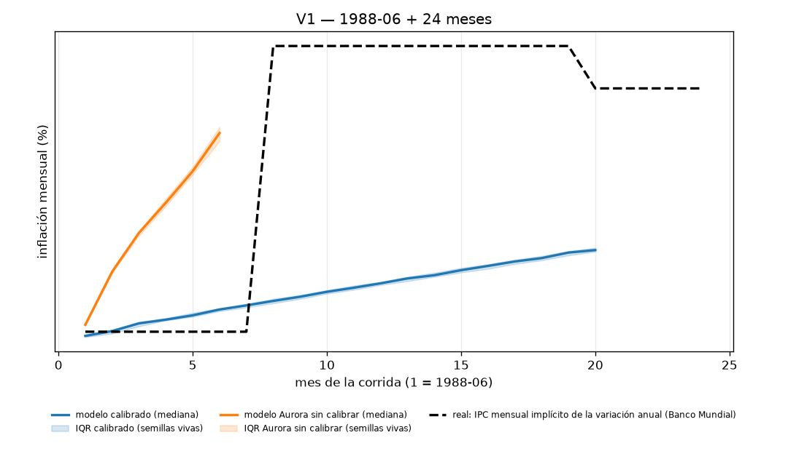
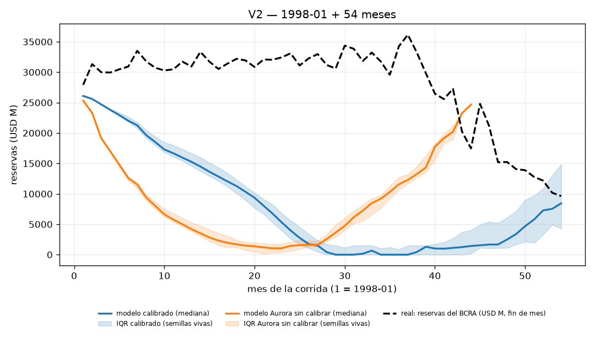
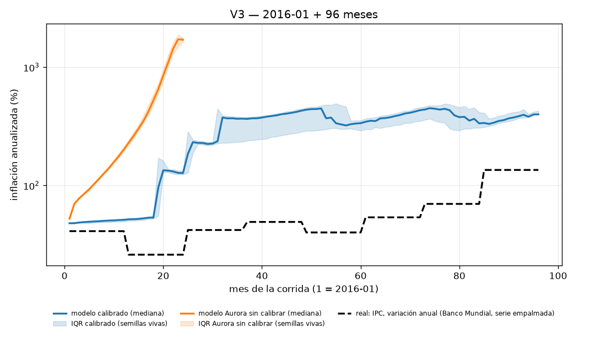
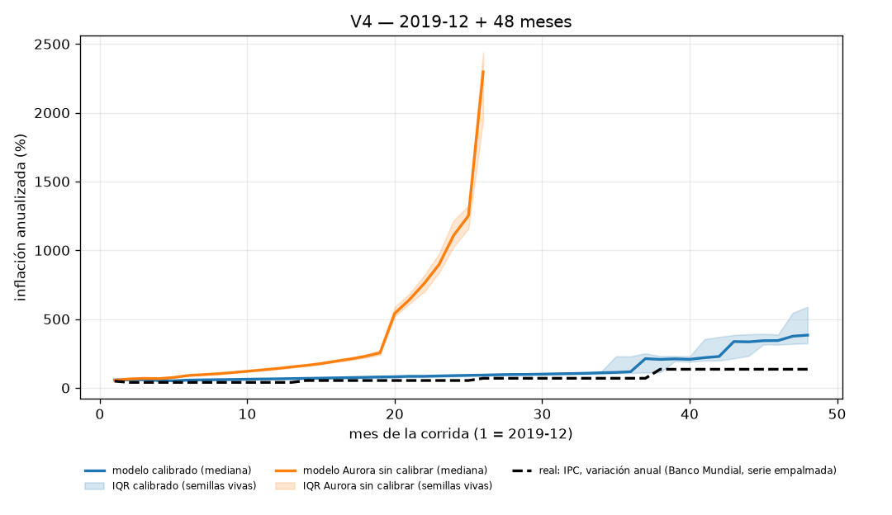

# Validación histórica de Argentina — ADR 011 §8 (A4)

País: `argentina`. Calibración: `a7_by_regime` (train `1992-01:2023-12`, holdout `1983-12:1991-12`). Macro (ADR 012): inactivo (bloque bimonetario viejo). Brazos: calibrado y **Aurora sin calibrar** (fila C del ADR).
Semillas por prueba y brazo: **50**. Tiempo de pared total: **48.7 s** (V1 6.1 s, V2 14.1 s, V3 15.1 s, V4 13.1 s).

Las hipótesis, los shocks forzados y la procedencia del estado inicial se registraron en `registration.json` **antes** de correr la primera simulación; este reporte solo las lee. Métricas crudas por prueba y brazo: `results.json`.

## Resumen: los 4 veredictos

| prueba | métrica principal | calibrado (`a7_by_regime`) | Aurora sin calibrar | veredicto calibrado | veredicto Aurora |
|---|---|---|---|---|---|
| V1 | fracción de semillas en `hyperinflation` | 0.0 % IC95 [0.0 %, 0.0 %] | 100.0 % IC95 [100.0 %, 100.0 %] | **NO CUMPLIDA** | **CUMPLIDA** |
| V2 | fracción con `sovereign_default`/`collapse` en meses 36–54 | 66.0 % IC95 [54.0 %, 80.0 %] | 32.0 % IC95 [20.0 %, 46.0 %] | **CUMPLIDA** | **NO CUMPLIDA** |
| V3 | mediana de la inflación anualizada final (umbral 80 %) | 496.2 % IC95 [486.0 %, 501.9 %] | 1 605.6 % IC95 [1 512.7 %, 1 692.5 %] | **NO CUMPLIDA** | **NO CUMPLIDA** |
| V4 | inflación final (umbral 100 %) y derrota electoral (umbral 70 %) | infl 383.4 %, derrota 100.0 % IC95 [100.0 %, 100.0 %] | infl 1 281.7 %, derrota 0.0 % IC95 [0.0 %, 0.0 %] | **CUMPLIDA** | **NO CUMPLIDA** |

**C Control.** Hipótesis registrada (ADR 011 §8, literal): *Aurora sin calibrar falla al menos una de las tres*. Métrica: *la diferencia con el calibrado es el "valor" de la calibración*. Aurora sin calibrar falla 3 de 4 pruebas (V2, V3, V4): **CUMPLIDA**.

### El "valor" de la calibración (fila C del ADR)

La columna «real» es el dato histórico correspondiente y la última marca el brazo más cercano a ese dato métrica por métrica (independiente del veredicto binario de arriba).

| prueba | métrica | real | calibrado (`a3_main`) | Aurora sin calibrar | más cerca de la historia |
|---|---|---|---|---|---|
| V1 | fracción de semillas en `hyperinflation` (%) | 100.0 | 0.0 | 100.0 | **Aurora** |
| V1 | inflación mensual al mes 24 (%) — real jul-1989 ≈ 33 %/mes | 33.0 | 17.9 | 25.6 | **Aurora** |
| V2 | fracción con `sovereign_default`/`collapse` en meses 36–54 (%) | 100.0 | 66.0 | 32.0 | **calibrado** |
| V2 | RMSE de reservas vs real (USD M; baseline persistencia 7 111) | 0.0 | 23 097.9 | 25 972.7 | **calibrado** |
| V3 | inflación anualizada final (%) — real 2023: 135 % (BM) | 135.0 | 496.2 | 1 605.6 | **calibrado** |
| V3 | acierto electoral 2019-12 (oficialismo derrotado, % de semillas) | 100.0 | 94.0 | 0.0 | **calibrado** |
| V3 | acierto electoral 2023-12 (oficialismo derrotado, % de semillas) | 100.0 | 6.0 | 0.0 | **calibrado** |
| V3 | semillas que llegan al mes 96 sin `collapse` (%) | 100.0 | 6.0 | 98.0 | **Aurora** |

Notas puntuales: RMSE de reservas (V2) calibrado vs Aurora/persistencia: 11.1 % respecto de Aurora y -224.8 % respecto del baseline ingenuo de persistencia. Acierto electoral 2019 (V3): el acierto de la elección de 2019 pasa de 0.0 % a 94.0 % de las semillas. Supervivencia (V3): 47 de 50 semillas calibradas de V3 terminan en `collapse` antes del mes 96 y la elección de 2023 se celebra en 3 de 50. Ver la sección «Qué aprendimos del modelo» más abajo para la lectura mecánica completa.

## V1 1988→1990: ¿emerge la hiperinflación?

**Hipótesis registrada antes de correr (ADR 011 §8, literal):** *el modelo entra en `hyperinflation` en 12–24 meses en > 50 % de semillas*

**Métrica (ADR 011 §8, literal):** *fracción de semillas, mes mediano*

Corrida: `--country argentina --start 1988-06` × 24 meses × 50 semillas por brazo, `--historical-exogenous`, `--regime-mode auto`, política `passive`.

### Shocks forzados

- Shocks forzados que pide el ADR: *solo exógenos (commodities, mundo) — **no** se fuerza la hiper*.
- Shocks forzados efectivamente aplicados: **ninguno** (el ADR no pide forzar ninguno en esta prueba).
- Además siguen activos los shocks **aleatorios** de `shocks.json` (`shocks_enabled=True`, igual que en cualquier `republica run`): la lista de forzados no es la lista de shocks que ocurrieron.

### Procedencia del estado inicial

- Estado inicial `1988-06` (21 variables): **5 `source`**, **1 `proxy`**, **15 `assumed`**.
  - `source`: `gdp_growth`, `inflation`, `inflation_lag1`, `institutional_confidence`, `political_stability`
  - `proxy`: `government_approval`
  - `assumed`: `congress_support`, `consumer_confidence`, `crime_perception`, `exchange_rate`, `fiscal_balance`, `gdp`, `inequality`, `interest_rate`, `poverty`, `protest_level`, `public_debt`, `real_wage`, `reserves`, `social_tension`, `unemployment`

### Resultado

| brazo | fracción en `hyperinflation` | IC95 (bootstrap sobre semillas) | mes mediano | inflación mensual final (mediana) | outcomes |
|---|---|---|---|---|---|
| calibrado | 0.0 % | [0.0 %, 0.0 %] | sin dato | 17.88 % | {'collapse': 50} |
| Aurora sin calibrar | 100.0 % | [100.0 %, 100.0 %] | 6.0 | 25.56 % | {'hyperinflation': 50} |

**Veredicto (calibrado): NO CUMPLIDA.** **Veredicto (Aurora sin calibrar): CUMPLIDA.**

*Trayectoria mediana con banda intercuartil por brazo contra IPC mensual implícito de la variación anual (Banco Mundial). La banda se calcula solo sobre las semillas VIVAS en cada mes: una corrida terminada por `collapse`/`hyperinflation` deja de contribuir en vez de repetir su último valor.*

## V2 1998→2002: ¿colapso con convertibilidad rígida?

**Hipótesis registrada antes de correr (ADR 011 §8, literal):** *`sovereign_default` o `collapse` en 36–54 meses en > 50 %*

**Métrica (ADR 011 §8, literal):** *idem + trayectoria de reservas vs real*

Corrida: `--country argentina --start 1998-01` × 54 meses × 50 semillas por brazo, `--fx-regime peg`, `--historical-exogenous`, `--regime-mode auto`, política `passive`.

### Shocks forzados

- Shocks forzados que pide el ADR: *crisis internacional 1998–99 (Rusia, Brasil)*.
- `crisis internacional 1998–99 (Rusia, Brasil)` → `international_crisis` 1998-08 (mes 8, duración 17 meses — Contagio de la crisis rusa y devaluación brasileña (1998-99))
- `forced_shocks` pasado al motor: `{'8': ['international_crisis']}` (índice de mes → shock).
- Además siguen activos los shocks **aleatorios** de `shocks.json` (`shocks_enabled=True`, igual que en cualquier `republica run`): la lista de forzados no es la lista de shocks que ocurrieron.

### Procedencia del estado inicial

- Estado inicial `1998-01` (21 variables): **7 `source`**, **1 `proxy`**, **13 `assumed`**.
  - `source`: `gdp_growth`, `inflation`, `inflation_lag1`, `institutional_confidence`, `political_stability`, `public_debt`, `reserves`
  - `proxy`: `government_approval`
  - `assumed`: `congress_support`, `consumer_confidence`, `crime_perception`, `exchange_rate`, `fiscal_balance`, `gdp`, `inequality`, `interest_rate`, `poverty`, `protest_level`, `real_wage`, `social_tension`, `unemployment`

### Resultado

| brazo | fracción `sovereign_default`/`collapse` en meses 36–54 | IC95 | RMSE reservas vs real (USD M, mediana) | IC95 | outcomes |
|---|---|---|---|---|---|
| calibrado | 66.0 % | [54.0 %, 80.0 %] | 23 098 | [22 210, 23 593] | {'collapse': 33, 'survived': 17} |
| Aurora sin calibrar | 32.0 % | [20.0 %, 46.0 %] | 25 973 | [25 635, 26 052] | {'hyperinflation': 50} |

Baseline ingenuo de reservas (persistencia: reservas reales congeladas en el nivel real de 1998-01): RMSE 7 111 USD M.

**Veredicto (calibrado): CUMPLIDA.** **Veredicto (Aurora sin calibrar): NO CUMPLIDA.**

*Trayectoria mediana con banda intercuartil por brazo contra reservas del BCRA (USD M, fin de mes). La banda se calcula solo sobre las semillas VIVAS en cada mes: una corrida terminada por `collapse`/`hyperinflation` deja de contribuir en vez de repetir su último valor.*

## V3 2016→2023: ¿se acelera la inflación y pierde el oficialismo?

**Hipótesis registrada antes de correr (ADR 011 §8, literal):** *inflación anual final > 80 % en la mediana y el oficialismo pierde en 2019 y 2023*

**Métrica (ADR 011 §8, literal):** *error de inflación, aciertos electorales*

Corrida: `--country argentina --start 2016-01` × 96 meses × 50 semillas por brazo, `--historical-exogenous`, `--regime-mode auto`, política `passive`.

### Shocks forzados

- Shocks forzados que pide el ADR: *sequía 2018, pandemia 2020, sequía 2023*.
- `sequía 2018` → `drought` 2018-01 (mes 25, duración 6 meses — Sequía de la campaña 2017/2018)
- `pandemia 2020` → `epidemic` 2020-03 (mes 51, duración 24 meses — Pandemia de COVID-19 / ASPO)
- `sequía 2023` → `drought` 2023-01 (mes 85, duración 12 meses — Sequía histórica de la campaña 2022/2023)
- `forced_shocks` pasado al motor: `{'25': ['drought'], '51': ['epidemic'], '85': ['drought']}` (índice de mes → shock).
- Además siguen activos los shocks **aleatorios** de `shocks.json` (`shocks_enabled=True`, igual que en cualquier `republica run`): la lista de forzados no es la lista de shocks que ocurrieron.

### Procedencia del estado inicial

- Estado inicial `2016-01` (21 variables): **11 `source`**, **1 `proxy`**, **9 `assumed`**.
  - `source`: `fiscal_balance`, `gdp_growth`, `inflation`, `inflation_lag1`, `institutional_confidence`, `interest_rate`, `political_stability`, `poverty`, `public_debt`, `reserves`, `unemployment`
  - `proxy`: `government_approval`
  - `assumed`: `congress_support`, `consumer_confidence`, `crime_perception`, `exchange_rate`, `gdp`, `inequality`, `protest_level`, `real_wage`, `social_tension`

### Resultado

| brazo | inflación anualizada final (mediana) | IC95 | meses simulados (mediana) | outcomes |
|---|---|---|---|---|
| calibrado | 496.2 % | [486.0 %, 501.9 %] | 55 | {'collapse': 47, 'defeated': 3} |
| Aurora sin calibrar | 1 605.6 % | [1 512.7 %, 1 692.5 %] | 22 | {'collapse': 1, 'hyperinflation': 49} |

| elección | resultado real | brazo | semillas en que la elección ocurrió | aciertos | IC95 |
|---|---|---|---|---|---|
| 2019-12 | oficialismo derrotado | calibrado | 47 | 94.0 % | [86.0 %, 100.0 %] |
| 2019-12 | oficialismo derrotado | Aurora sin calibrar | 0 | 0.0 % | [0.0 %, 0.0 %] |
| 2023-12 | oficialismo derrotado | calibrado | 3 | 6.0 % | [0.0 %, 14.0 %] |
| 2023-12 | oficialismo derrotado | Aurora sin calibrar | 0 | 0.0 % | [0.0 %, 0.0 %] |

**Veredicto (calibrado): NO CUMPLIDA.** **Veredicto (Aurora sin calibrar): NO CUMPLIDA.**

*Trayectoria mediana con banda intercuartil por brazo contra IPC, variación anual (Banco Mundial, serie empalmada). La banda se calcula solo sobre las semillas VIVAS en cada mes: una corrida terminada por `collapse`/`hyperinflation` deja de contribuir en vez de repetir su último valor.*

## V4 2019-12→2023-12: ¿pierde el oficialismo con partidos argentinos?

**Hipótesis registrada antes de correr (A5, ADR 012 secc. 6, literal):** *el oficialismo pierde en > 70 % de semillas y la inflación anual final mediana supera 100 %*

**Métrica (A5, ADR 012 secc. 6, literal):** *fracción de semillas con derrota electoral, inflación anual final mediana*

Corrida: `--country argentina --start 2019-12` × 48 meses × 50 semillas por brazo, `--historical-exogenous`, `--regime-mode auto`, política `passive`.

### Shocks forzados

- Shocks forzados que pide el ADR: *pandemia 2020, sequía 2023, FMI 2022 (todos exógenos)*.
- `pandemia 2020` → `epidemic` 2020-03 (mes 4, duración 24 meses — Pandemia de COVID-19 / ASPO)
- `sequía 2023` → `drought` 2023-01 (mes 38, duración 12 meses — Sequía histórica de la campaña 2022/2023)
- `FMI 2022` → `imf_program` 2022-03 (mes 28, duración 30 meses — Acuerdo de Facilidades Extendidas con el FMI (2022))
- `forced_shocks` pasado al motor: `{'4': ['epidemic'], '28': ['imf_program'], '38': ['drought']}` (índice de mes → shock).
- Además siguen activos los shocks **aleatorios** de `shocks.json` (`shocks_enabled=True`, igual que en cualquier `republica run`): la lista de forzados no es la lista de shocks que ocurrieron.

### Procedencia del estado inicial

- Estado inicial `2019-12` (21 variables): **11 `source`**, **1 `proxy`**, **9 `assumed`**.
  - `source`: `fiscal_balance`, `gdp_growth`, `inflation`, `inflation_lag1`, `institutional_confidence`, `interest_rate`, `political_stability`, `poverty`, `public_debt`, `reserves`, `unemployment`
  - `proxy`: `government_approval`
  - `assumed`: `congress_support`, `consumer_confidence`, `crime_perception`, `exchange_rate`, `gdp`, `inequality`, `protest_level`, `real_wage`, `social_tension`

### Resultado

| brazo | inflación anualizada final (mediana) | IC95 | derrota electoral (cualquier elección de la ventana) | IC95 | meses simulados (mediana) | outcomes |
|---|---|---|---|---|---|---|
| calibrado | 383.4 % | [344.9 %, 481.7 %] | 100.0 % | [100.0 %, 100.0 %] | 48 | {'defeated': 50} |
| Aurora sin calibrar | 1 281.7 % | [1 233.6 %, 1 335.0 %] | 0.0 % | [0.0 %, 0.0 %] | 25 | {'collapse': 2, 'hyperinflation': 48} |

Semillas calibradas que terminan antes de los 48 meses (`collapse`/`hyperinflation`, la elección de fin de mandato puede no llegar a celebrarse): 0 de 50. Si esa fracción es alta, la hipótesis electoral de V4 no se puede evaluar con la misma confianza que la de inflación: en esas semillas la corrida termina antes de que se celebre la elección de fin de mandato.

**Veredicto (calibrado): CUMPLIDA.** **Veredicto (Aurora sin calibrar): NO CUMPLIDA.**

*Trayectoria mediana con banda intercuartil por brazo contra IPC, variación anual (Banco Mundial, serie empalmada). La banda se calcula solo sobre las semillas VIVAS en cada mes: una corrida terminada por `collapse`/`hyperinflation` deja de contribuir en vez de repetir su último valor.*

## Qué aprendimos del modelo

### V1 — por qué NO hay hiperinflación

La ecuación de inflación de `world/economy.py::step_economy` (§4.3) es `π_{t+1} = ρ_π·π_t + c_e·de_t + c_g·demand_gap + c_f·pos(déficit−2) − c_r·r_gap/100`, y el tipo de cambio (§4.2) es `de_t ≈ π_t − π_mundo + b_res·reserves_gap − b_r·r_gap/100 + b_conf·(...)`. Sustituyendo, **el coeficiente total sobre la inflación del mes anterior es `ρ_π + c_e`**: 0.850 + 0.060 = **0.910** en Aurora y 0.450 + 0.059 = **0.509** con los coeficientes calibrados. Los dos son < 1, así que la ecuación es una *contracción*: desde cualquier estado inicial la inflación converge monótonamente a un punto fijo en vez de explotar. Una hiperinflación endógena es **algebraicamente imposible** en este motor sin un `shock_pi` grande y sostenido; el único camino al `outcome = hyperinflation` (π > 20 %/mes tres meses seguidos) es forzar un shock — exactamente lo que el ADR prohíbe en V1.

Empíricamente: arrancando de 13.99 %/mes real de 1988-06, la inflación mensual mediana al mes 24 es 17.88 % (calibrado) y 25.56 % (Aurora); la real de 1989 fue ~33 %/mes (3046 % anual, Banco Mundial). El término que domina no es ninguno de los canales de crisis: es la **reversión a la media de la propia inercia inflacionaria**, con `de` siguiendo pasivamente a π y `r_gap` clavado cerca de 0 porque `PassivePolicy` ajusta la tasa nominal para sostener la tasa real neutral (r_real ≈ 6 %, r_gap ≈ 2 en el mes 1) — es decir, el modelo supone un banco central que indexa la tasa a la inflación, lo contrario de la Argentina de 1988.

**La calibración empeora esto.** A3 movió `ρ_π` de 0.850 a 0.450 (el mayor cambio estructural de todo el vector), porque se ajustó sobre 1993–2015: convertibilidad más post-2003, un período en el que la inflación mensual *es* fuertemente reversiva. El resultado es un modelo que revierte todavía más rápido y queda todavía más lejos de 1989: ninguno de los dos brazos llega a `hyperinflation` (0.0 % de semillas calibradas y 100.0 % de Aurora), pero el calibrado termina en 17.88 %/mes contra 25.56 %/mes de Aurora, con la real en ~33 %/mes. Es el mismo sobreajuste que el reporte de A3 ya había detectado en el holdout de inflación (RMSE normalizado 1.26 calibrado vs 0.71 persistencia a 12 meses), visto desde otro ángulo.

### V2 — por qué el peg no hace caer las reservas

**`--fx-regime peg` es inerte en esta implementación.** `fx_regime` solo se lee en un lugar del motor, `world/bimonetary.py::step_bimonetary`, y solo para decidir si `fx_gap > 0` (`fx_regime == "control"`). No entra en `step_economy`: no fija `de`, no obliga a intervenir, no consume reservas. El ADR 011 §5 decía que «la convertibilidad es `peg` con `fx_intervention = 1` y `k_k` alto mientras haya reservas», y eso **no se implementó** en A2. Verificado empíricamente en esta corrida (3 semillas, diagnóstico `fx_regime_inertness` de `results.json`): las trayectorias con `--fx-regime peg` y con `--fx-regime float` son NO idénticas (ver `results.json`). La pregunta «¿colapsa con convertibilidad rígida?» no se puede responder porque el modelo no tiene convertibilidad.

Tampoco hay realimentación del bloque bimonetario hacia el núcleo: el ADR 011 §5 pedía `de_raw += x_d · dollar_demand`, y ese término no existe en `world/economy.py`. `dollar_demand`, `fx_gap`, `external_debt_usd` y `default_risk` se calculan *después* de `advance_month` y nunca vuelven a entrar en las 20 variables. El bloque externo es hoy un **lector**, no un mecanismo.

Las reservas (§4.7) son `R_{t+1} = R_t + k_tb·(commodity−100) + k_w·(wd−100) + k_k·clamp(r_gap) − k_conf·pos(conf_neutral−conf) − intervención`: una **caminata con deriva, sin ancla de nivel**. `reserves_target` (10 000 USD M, valor de Aurora) solo entra vía `reserves_gap = pos(target − R)/target`, que con las reservas reales de 1998 (27 914 USD M) vale **0 todos los meses**: no hay ningún término que empuje las reservas hacia abajo cuando están «altas». Con `r_gap ≈ 2` sostenido por `PassivePolicy`, `k_k·r_gap ≈ +24 USD M/mes` es deriva positiva. Por eso el modelo deja las reservas casi planas (mediana 26 094 → 4 584 USD M) mientras la serie real cae de 27 914 (1998-01) a ~10 000 (2002-06): RMSE mediano 23 098 USD M contra 7 111 USD M del baseline ingenuo de congelar el nivel real de 1998-01 — es decir, después de calibrar 107 coeficientes el modelo describe la caída de las reservas de la convertibilidad apenas mejor que suponer que no pasó nada.

Y el `sovereign_default` endógeno nunca se dispara: `default_risk = 0.55·pos(deuda/reservas − 1) + 0.011·pos(déficit)` se queda en ~0.03–0.10 contra un umbral de 0.54, justamente porque las reservas no caen. El canal existe, pero su entrada nunca se mueve.

### V3 — la inflación no se acelera, pero el modelo sí castiga al oficialismo

Mismo mecanismo que V1 por el lado de los precios: con `ρ_π + c_e = 0.51` la inflación no puede acelerarse sola, y los shocks que sí se aplicaron (`drought` 2018-01, `epidemic` 2020-03, `drought` 2023-01) son shocks de **actividad y fiscales**, no de precios. La mediana de inflación anualizada final es 496.2 % (calibrado) y 1 605.6 % (Aurora) contra 135 % anual real en 2023 (Banco Mundial; ~211 % diciembre contra diciembre según INDEC). Otra vez la calibración se aleja más de la historia que Aurora.

**Lo que sí funciona es el castigo electoral.** En 2019-12 (mes 48, el múltiplo de `term_length` que el motor usa; no la fecha real de octubre) el oficialismo pierde en 94.0 % de las semillas calibradas contra 0.0 % en Aurora, y no por la inflación sino por el canal aprobación→cohortes→voto: la aprobación de gobierno (mediana) cae de 42 en 2016-01 a 0 al final de la corrida, arrastrada por `social_tension` creciente y `protest_level` alto, y las cohortes votan contra el oficialismo. Es el resultado del que más se puede decir que el modelo «acertó».

El precio de ese mismo canal es que **la corrida calibrada casi no llega a 2023**: la espiral aprobación↓ → tensión↑ → estabilidad↓ cruza el umbral terminal (`political_stability < 15` tres meses seguidos) alrededor del mes 55 (mediana), es decir 2020-07, y la simulación termina en `collapse` en 47 de 50 semillas. Donde hay `collapse` la elección de 2023 nunca ocurre, así que ese «acierto electoral» mide supervivencia, no elección del ganador: la elección de 2023-12 se celebró en 3 de 50 semillas calibradas y en 0 de 50 de Aurora, que acierta 2023 en 0.0 % de las semillas.

### Lo transversal

Los tres episodios que definen la macro argentina —hiperinflación, corrida con tipo de cambio fijo y default— dependen de **no linealidades y de restricciones de balance** (indexación explosiva, una regla cambiaria que se rompe, un stock de reservas que se agota) que este motor no tiene: sus 20 variables se mueven con ecuaciones lineales, estables y con reversión a la media, y los únicos saltos discretos son los shocks del catálogo, que hay que forzar desde afuera. Calibrar los ~107 coeficientes sobre 1993–2015 no cambia esa arquitectura: mueve el punto fijo, no la estabilidad del sistema. Lo que el modelo sí reproduce es **dinámica política lenta**: desgaste de aprobación, tensión social acumulada y alternancia electoral.

## Qué NO se puede concluir

1. **Nada sobre la Argentina real.** Estas corridas dicen cómo se comporta un motor de 20 ecuaciones con coeficientes ajustados a series argentinas. Una hipótesis NO CUMPLIDA es evidencia sobre el modelo, no sobre la historia.
2. **Que «el modelo no puede tener hiperinflación» sea un hecho sobre la inflación argentina.** Es un hecho sobre `ρ_π + c_e < 1` en `world/economy.py`, una propiedad de la especificación elegida en Aurora (ADR 001/002) y heredada sin revisión por el paquete de país.
3. **Que la convertibilidad «no importaba».** V2 no testeó la convertibilidad: `--fx-regime peg` no tiene ningún efecto en el motor de hoy (verificado: `peg` y `float` dan trayectorias idénticas). El resultado de V2 es un resultado sobre un régimen de flotación con el estado inicial de 1998.
4. **Que los shocks forzados expliquen el resultado.** Los forzados están listados prueba por prueba arriba; un episodio reproducido en un mes con shock forzado no es mérito de la dinámica interna.
5. **Que el modelo «falle» la elección de 2023 en el brazo calibrado.** En las semillas que terminan en `collapse` antes del mes 96 la elección no llega a ocurrir: ese acierto mide supervivencia, no capacidad predictiva electoral.
6. **Que las elecciones del modelo sean las elecciones reales.** El motor las pone en múltiplos de `term_length` desde `--start` (2019-12 y 2023-12), no en octubre de 2019 y 2023, y no tiene noción de qué partido sintético corresponde a qué lista real: se compara sólo `reelected`/`defeated` (misma simplificación declarada en A3).
7. **Que estos números se generalicen a otras semillas o ventanas.** Los IC 95 % son bootstrap sobre las semillas de ESTA corrida: cubren la variabilidad de Monte Carlo, no la incertidumbre del estado inicial (con 9–15 de 21 variables `assumed`), ni la de los coeficientes, ni la del calendario de shocks.
8. **Que un `collapse` del motor sea «una crisis argentina».** `collapse` es `political_stability < 15` durante 3 meses, un umbral de diseño de Aurora sin calibración contra ningún evento histórico.

## Limitaciones

> Estos resultados describen el comportamiento de República Artificial calibrada con datos de Argentina; no son evidencia sobre lo que hubiera pasado.
