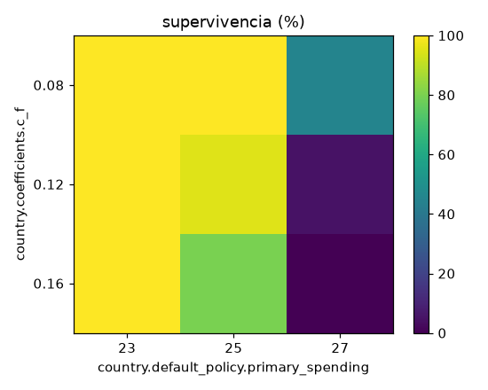
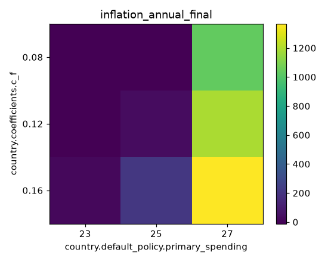
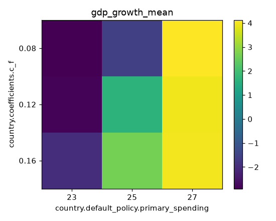

# Reporte de experimento -- fiscal_rule

**Hipotesis / descripcion registrada:** Hipotesis: la supervivencia cae y la inflacion anualizada final sube a medida que aumenta `c_f` (mas traspaso de deficit a precios) y/o `primary_spending` (mas gasto primario, a igual `tax_rate`) -- el mapa de calor deberia mostrar el peor cuadrante en c_f=0.16 x primary_spending=27 y el mejor en c_f=0.08 x primary_spending=23.

Semillas: 0..19 (20 por brazo). Brazos: 9. Version del paquete: 0.1.0.

## Por brazo

| brazo | N | outcomes | inflation_annual_final | gdp_growth_mean | unemployment_final | approval_final | stability_min | reserves_min |
|---|---|---|---|---|---|---|---|---|
| base__c_f=0.08__primary_spending=23 | 20 | defeated=19, reelected=1 | -11.36 [-11.36, -11.36] | -2.90 [-3.16, -2.76] | 17.38 [16.83, 17.59] | 42.96 [42.18, 43.54] | 43.86 [40.90, 45.81] | 8000.72 [7877.34, 8171.33] |
| base__c_f=0.08__primary_spending=25 | 20 | defeated=18, reelected=2 | -11.36 [-11.36, -11.32] | -1.56 [-1.87, -1.40] | 15.34 [14.80, 15.51] | 42.67 [41.86, 43.20] | 46.63 [43.96, 49.13] | 7929.22 [7405.13, 8139.94] |
| base__c_f=0.08__primary_spending=27 | 20 | hyperinflation=11, defeated=8, reelected=1 | 1037.48 [704.19, 1313.81] | 4.12 [3.84, 4.58] | 5.74 [4.71, 6.09] | 0.00 [0.00, 43.50] | 20.82 [17.49, 26.21] | 0.00 [0.00, 23.82] |
| base__c_f=0.12__primary_spending=23 | 20 | defeated=20 | -8.24 [-10.66, -3.13] | -2.83 [-2.95, -2.71] | 17.07 [16.75, 17.34] | 43.80 [43.10, 44.36] | 39.97 [37.58, 42.18] | 7985.14 [7841.91, 8146.67] |
| base__c_f=0.12__primary_spending=25 | 20 | reelected=10, defeated=9, hyperinflation=1 | 35.50 [28.17, 52.26] | 1.63 [0.97, 1.91] | 8.76 [8.19, 10.43] | 35.81 [31.48, 41.87] | 50.61 [47.48, 52.97] | 5858.63 [3875.10, 7655.83] |
| base__c_f=0.12__primary_spending=27 | 20 | hyperinflation=17, collapse=2, defeated=1 | 1190.04 [1060.23, 1433.11] | 3.96 [3.74, 4.58] | 6.18 [5.28, 6.96] | 0.00 [0.00, 0.00] | 15.89 [14.79, 17.21] | 0.00 [0.00, 0.00] |
| base__c_f=0.16__primary_spending=23 | 20 | defeated=20 | 15.91 [13.63, 18.73] | -1.98 [-2.19, -1.68] | 14.85 [14.29, 15.49] | 43.54 [42.66, 44.32] | 41.24 [39.15, 42.93] | 7966.14 [7797.38, 8139.42] |
| base__c_f=0.16__primary_spending=25 | 20 | defeated=10, reelected=6, hyperinflation=4 | 212.36 [49.50, 602.31] | 2.65 [2.54, 2.84] | 7.53 [6.99, 7.89] | 41.42 [35.62, 45.74] | 39.76 [26.54, 49.99] | 1035.68 [0.00, 5737.76] |
| base__c_f=0.16__primary_spending=27 | 20 | hyperinflation=17, collapse=3 | 1367.01 [1215.24, 1762.42] | 3.99 [3.69, 4.19] | 6.41 [5.96, 6.97] | 0.00 [0.00, 0.00] | 13.75 [11.81, 16.17] | 0.00 [0.00, 0.00] |

## Mapa de calor (country.coefficients.c_f x country.default_policy.primary_spending)

Supervivencia (%):

| c_f \ primary_spending | 23 | 25 | 27 |
|---|---|---|---|
| 0.08 | 100 % | 100 % | 45 % |
| 0.12 | 100 % | 95 % | 5 % |
| 0.16 | 100 % | 80 % | 0 % |

inflation_annual_final (mediana):

| c_f \ primary_spending | 23 | 25 | 27 |
|---|---|---|---|
| 0.08 | -11.36 | -11.36 | 1037.48 |
| 0.12 | -8.24 | 35.50 | 1190.04 |
| 0.16 | 15.91 | 212.36 | 1367.01 |

gdp_growth_mean (mediana):

| c_f \ primary_spending | 23 | 25 | 27 |
|---|---|---|---|
| 0.08 | -2.90 | -1.56 | 4.12 |
| 0.12 | -2.83 | 1.63 | 3.96 |
| 0.16 | -1.98 | 2.65 | 3.99 |

## Limitaciones

Estos resultados describen el comportamiento de República Artificial bajo sus reglas; no son evidencia sobre economías reales.
